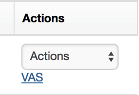
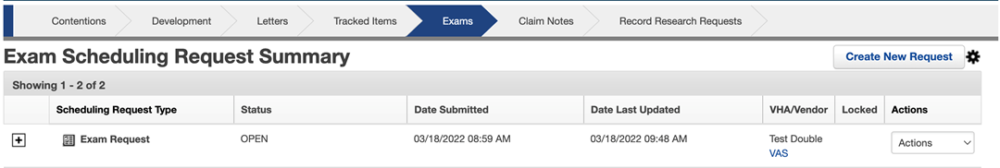
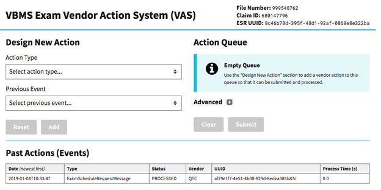
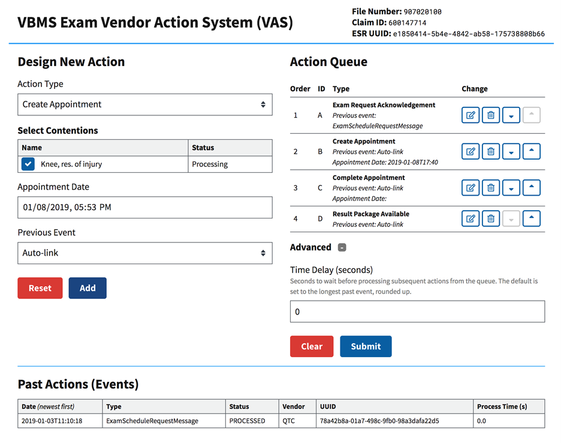
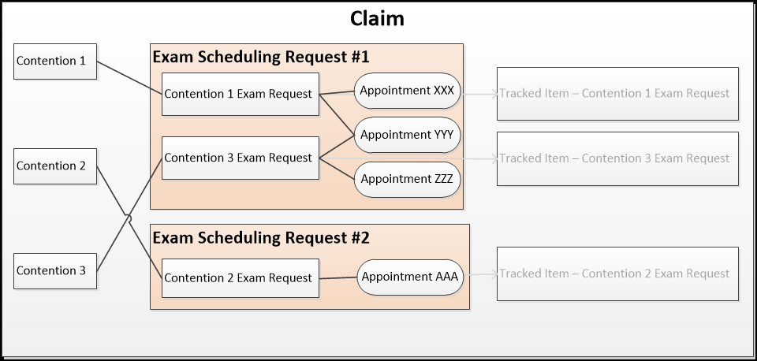
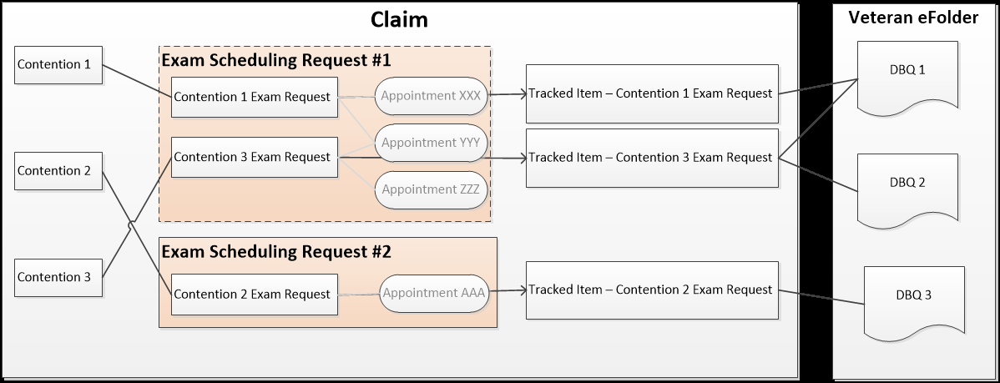

# Exam Management Reference Guide_1a51c851bf9f46efba5c29be62796c0b-040226-1750-2398

> This document was automatically converted from PDF: `Exam Management Reference Guide_1a51c851bf9f46efba5c29be62796c0b-040226-1750-2398.pdf`
> 
> Generated on: 2026-02-04 17:53:57
> Images extracted: 20

---

## Page 1

Exam Management Reference Guide
Summary
The Exam Management feature exists within VBMS-Core to initiate and manage exam scheduling requests from within the application. This feature 
provides integration with the various external partners, which include DAS, the VHA, and multiple VBA Exam Contractors.
The Exam Management feature offers the following value:
Efficiency - Users have the ability to conduct all exam management activities within VBMS.
Quality – A majority of the data provided in the exam scheduling request is auto-populated from the Veteran Profile and the claim data. Business 
rules are systematically enforced.
Transparency – By receiving information from the VHA and vendors directly into VBMS, all authorized users can view the state of the scheduling 
request.
Summary
Revision History
1. Creating a New Scheduling Request
Select Contentions
Claim Information
Contention Information
Preview
Delete Request
Save Request
Submit Request
Processing of Scheduling Request by DAS
Acknowledgment of Scheduling Request
2. Request for Clarification
3. Response to Request for Clarification
Claim Information
Contention Information
Preview
Save Request
Submit Response
4. Modifications
Cancel Entire Scheduling Request
Cancel Contention(s)
Change Address
Modify Appointments
Provide Additional Information
Cancel Modification
Save Modification
5. Contention Cancellation from the VHA/Vendor
6. Medical Appointments
New Appointments
Canceled Appointments
Rescheduled Appointments
Completed Appointments
7. Results Package Received
8. Creating a Rework Scheduling Request
9. Copying a Scheduling Request
Copying or Reworking an ESR on a New Claim
10. Editing Contentions that are Included on a Scheduling Request
11. Vendor Action System (VAS)
12. Extension Request Event Package
Appendix A: Standard Language Narratives
Appendix B: Relationships Between Contentions, Tracked Items, Appointments, and DBQs
Appendix C: Scheduling Request Status Values
Appendix D: Contention Level Status Values
Appendix E: Appointment Status Values
Appendix F: Data Workflow and VBMS Error Handling
VBMS-to-EMS (“Outbound) Workflow and Error Handling
EMS-to-VBMS (“Inbound”) Workflow and Error Handling
Appendix G: Exam Summary Page Indicators
Appendix H: Handling IEPD Changes
 EDIT/UPDATE IF POSSIBLE
Revision History

## Page 2

Revised By Re
vis
ed 
OnRevisions Made
    
Cheryl Blocker 09
/16
/20
16Initial publication of this document, reflecting implementation as of Release 11.0.
Daniel Cordle 10
/30
/20
16Updated to reflect functionality as of Release 12.0. Updates include:
Updated portions of Resulting Output and Important Notes in ‘Types of Scheduling Request Messages’ section
Updated Error Handling sections with most recent functionality updates
Updated Exam Summary Page indicator descriptions
Daniel Cordle 5/1
/20
17Updated to better organize the information in accordance with the lifecycle of a scheduling request. Also updated to reflect 
functionality as of Release 13.0.
Daniel Cordle 7
/24
/20
17Updated to reflect the following system functionality:
Scheduling requests in Draft status can only be modified by one user at a time
Once the blue information icon is displayed, the icon is permanently associated with the scheduling request
When a contention associated with a scheduling request is deleted outside of VBMS, the system displays the error icon 
next to the scheduling request.
Daniel Cordle 10
/12
/20
17Updated to reflect updates to the workflow based on the 03072017 Change Order. Also added Appendix A to define the 
narratives that should appear based on the conditions of the scheduling request, contention, and claim.
Daniel Cordle 1
/23
/20
18Updated Initial Scheduling Request, Response to Request for Clarification, Results Package Received, and Rework sections 
to account for changes made in 14.1.
Jennifer Holliday 7
/27
/20
18Changed ‘CAVC Remand’ references to ‘Remand’ and updated available EP types for Remand for release 15.1.
Jennifer Holliday 10
/5
/20
18Updated to reflect changes for release 16.0, including:
PEBLO and MSC contact info changed from required to optional (IDES)
Updated list of DBQ’s that can be applied to all contentions
Updated Appendix C with statuses for scheduling requests and contentions
Updated Appendix G with new icon for scheduling request, contention, and appointment level informational icon.
Thomas Moorer 12
/9
/20
18Added Appendix H, which explains Handling IEPD Changes.
Jerraca Davis 1/4
/20
19Updated to add documentation for the new Vendor Action System (VAS) implemented for Release 16.1
Jerraca Davis 4/5
/20
19Updated to add documentation for the Copy functionality implemented for Release 17.0
Beth McLeod, 
Patricia 
Rodriguez, 
Jerraca Davis6
/25
/20
19Updated to reflect changes for Release 17.1, including:
Updates to support ESRs for Death/Dependency claims
Updates to clarification request and response functionality
Jerraca Davis 12
/2
/20
19Updated to reflect changes for Release 18.0, including:
Ability to copy an ESR from a closed claim onto an open claim
Updates to ESR cancellation functionality

## Page 3

Kelly Leonard 9/3
/20
21Updated to reflect changes implemented since 2019, including:
   Updated Appendices A, C, D, E, F, H to include new terminal statuses added with the Admin Cancel function, updated 
retry logic to replace user-driven error retry, removed ACE ASSIGNED appointment status, updated language around IEPD 
changes, and various other formatting and wording updates throughout.
Jerraca Davis 1
/31
/20
22Updated to correct outdated language, add information about dependent ESRs, and reflect other changes since FY21Q4
Charlie Egress 10
/25
/20
22Updated to reflect changes since FY22Q4:
Updated outdated language where “specialty language” is referenced to “medical opinion”
Updated Medical Opinions section to reflect that Medical Opinion Language is applied across each selected Contention 
with the ‘Hearing Loss’ Contention Classification
Updated Contention Information section to reflect “Veteran Must Report” auto-selection/required function 
Orianna Gandy-
Wells11
/1
/20
23Updated to reflect the addition of the "Extension Request Event Package" in IEPD Version 4.4.
New description of 'Extension Request' functionality
Charlie Egress
Byron Bacon
Byron Bacon4
/15
/20
24
4
/24
/20
24
11
/20
/20
24Updated the Completed Appointment section to reflect the ability to view the  value of round-trip miles received by VBMS in 
the Appointment Completed Event Package (IEPD 4.5).
This value will be shown in the Exam Details, Transaction History, and Enhanced Transaction History
Updated the Medical Opinion section to reflect when the user selects Toxic Exposure Medical Opinion Specialty Language 
(in addition to any body system DBQ automatically selected by the current rules), the "DBQ Medical Opinion” is automatically 
selected for each Contention.
Updated Extension Request Event Package section to provide greater detail surrounding ineligible event packages and fault 
messaging.  
Updated Extension Request Event Package section to provide greater detail surrounding ineligible event packages, specific 
to pending clarification requests.
Updated Modify Appointments section, adding that  a user is restricted from attempting to modify an appointment within 1 day 
of the scheduled appointment.  This had been existing functionality since 2017 or 2018.
Modupe 
Sodeinde1
/31
/20
25Updated the Request for Clarification section to reflect the creation of "Exam Rework - Request for Clarification" tracked item.
Updated the canceled appointment section to reflect contention suspense date update when a canceled appointment is the 
only appointment associated to the contention . 
Updated the Canceled appointments section to reflect contention suspense date update when there are multiple 
appointments associated to the contention.
Byron Bacon 4
/21
/20
25Updated section "Creating a Rework Scheduling Request", to reflect changed implemented by VBMSR-17214.  Rework can 
be performed on Completed contentions regardless of the ESR state.
1. Creating a New Scheduling Request
To create a new scheduling request, users can click on the Exams chevron of the claim and then click ‘Create New Request.’ The user will then be taken 
to the following workflow:
Select Contentions
All contentions associated with the claim are presented on this tab.
A contention cannot be selected for inclusion on the scheduling request when one or more of the following conditions are met:
The contention is of type Increase or RFE but is not associated with a service connected disability

## Page 4

The contention is non-Medical
The contention classification is ‘Administrative Issue’
The contention is included on another scheduling request for the same claim with a contention level status of ‘Draft’, ‘Submitting’, 
‘Processing’, ‘Triage’, ‘Open’, or ‘Scheduled’, or ‘Pending Results’.
The claim is of type Pre-Discharge with a Pre-Discharge Type of IDES and the contention does not have a value in the “Referred by 
DoD Physician” field on the Contentions tab
The contention has a classification of ‘Helpless Child’, ‘Pension – Aid and Attendance/Housebound’, ‘Aid and Attendance – Spouse’, or 
‘Spina Bifida’, the ESR is for a dependent of the Veteran, and any other contention has already been added to the ESR.
Once at least one contention has been selected for inclusion on the scheduling request, the status bar below the Select Contentions tab will turn 
green and the user can proceed to entering the relevant Claim Information and Contention Information.
Claim Information
The POA on the scheduling request is pulled from the POA on the claim, unless the ESR is for a dependent of the Veteran in which case the POA 
will be pulled from the Dependent Profile. Users may change the POA during the initial scheduling request workflow, but any changes made to the 
POA during the scheduling request workflow will not update the data on the claim or Veteran/Dependent Profiles.
If the Payee Code on the claim is a value other than ‘00’ (Veteran), or a dependent has been selected when identifying the contentions for the 
ESR, then survivor or dependent information will be pre-populated on the scheduling request. The PDF for the ESR will state “This Exam 
Scheduling Request has been requested on behalf of a dependent of the Veteran.”
When the claim associated with the scheduling request is in the EP 030, 040, 070, 170, 682 or 683 series, users have the ability to indicate that a 
Remand is needed.
When the claim is of type ‘Pre-Discharge’, the user has the ability to view the Pre-Discharge Scheduling Request information.
If the claim has a Pre-Discharge Type (IDES, BDD, or BDD-Excluded), the scheduling request will display the Pre-Discharge Type on 
the Claim Information page. The user cannot edit the Pre-Discharge Type in this case.
If the claim does not have a Pre-Discharge Type, the user is required to enter one on the Claim Information tab of the scheduling request 
workflow.
IDES scheduling requests require users to indicate whether Veteran is pregnant when the Veteran gender is Female or Other.
IDES scheduling requests have PEBLO and MSC Point of Contact information fields, which are optional. Users can select the ‘Specify 
Info’ checkbox to input PEBLO and/or MSC contact information.
When all required fields on the Claim Information page are complete, the status bar below the Claim Information tab will turn green.
Contention Information
When a scheduling request contains more than one contention, the user has the ability to select one or more of the following DBQs to apply to all 
contentions on the scheduling request:
DBQ General Medical – Compensation
DBQ General Medical - Gulf War (including Burn Pits)
DBQ General Medical - Pension
DBQ General Medical - Separation Health Assessment
When the claim type is Pre-Discharge, the Pre-Discharge Type is IDES, and the contention has the “Referred by DoD Physician” field completed 
on the Contentions tab, the user is able to view but not change the field.
When the claim type is Pre-Discharge but the Pre-Discharge Type field is unavailable at the claim level so the user selects a Pre-Discharge Type 
of IDES during the scheduling request workflow, the user is required to complete the field on the Contentions tab of the scheduling request.
The user has the ability to select either the ‘ACE Eligible’ or ‘Veteran Must Report to Exam’ indicator. The user cannot select both indicators for 
one contention. The “Ace Eligible” indicator will be selected automatically with the exception of claim types of Pre-Discharge IDES and BDD.
The “Veteran Must Report” indicator is auto-selected and required when any of the General Medical DBQs are selected.
When a contention with classification “Unemployability” is selected for inclusion on the scheduling request, the user is required to associate the 
contention to at least one service connected disability OR another contention on the claim that does not have a classification of Unemployability. 
The Employment Impact Assessment indicator is also checked by default.
The user is required to select at least one DBQ for each contention associated with the scheduling request.
Suggested DBQs are based on business rules and are displayed at the top of the DBQ list in yellow.
Automatic DBQ selections are based on business rules and will be automatically added to the ESR in yellow. The user can remove any DBQs 
that were automatically added, if necessary.
When the contention type is New or Reopened and the contention classification is ‘Post Traumatic Stress Disorder (PTSD) Combat – Mental 
Disorder’ or ‘Post Traumatic Stress Disorder (PTSD) Personal Trauma – Mental Disorder’, the user is required to:
specify whether the clinician should/should not confirm the stressor cause of the PTSD
provide a description of the Veteran’s Claimed Stressors.
Medical Opinions
When a user selects Medical Opinion ‘Aggravation of a Preexisting Condition’, the user is required to provide a Source of Aggravation in free text 
format.
When a user selects Medical Opinion ‘Audio Special Language Based on MOS-Related Hazardous Noise Exposure’, the user is prompted to 
provide a Military Occupation Specialty (MOS).
User is first required to enter a Branch of Service associated with the Veteran.
When the Branch of Service is Merchant Marine, Navy, or Coast Guard, user is required to select one or more Military Occupation 
Specialties.
When the Branch of Service is Army, Navy, Marine, or Air Force, user is first required to enter a Rank associated with the Veteran. The 
user is then required to provide at least one MOS but can provide multiple.
The MOS list is dynamic based on the combination of Branch of Service and Rank (if provided).
If more than one MOS is selected, ‘MOS Not Available’ is not an option in the Military Occupation Specialty dropdown.
For each MOS provided, the user is required to indicate the Document Type and Document Repository (eFolder or Virtual VA) 
associated with the eFolder document that supports the MOS. The user also has the option to provide a free text location within 
document to further identify the location of the evidence.

## Page 5

The same Medical Opinion Language is applied across each selected Contention with the ‘Hearing Loss’ Contention Classification 
unless the Contention Type is Increase or RFE.
When the user selects Medical Opinion ‘Respiratory Opinion based on MOS-Related Asbestos exposure (Navy Only)’ and the veteran associated 
with the scheduling request does not have one or more Periods of Service that contain Navy as the Branch of Service, the user is presented with 
an error message.
When the user selects Medical Opinion ‘Respiratory Opinion based on MOS-Related Asbestos exposure (Navy Only)’ and the veteran associated 
with the scheduling request has one or more Periods of Service that contain Navy as the Branch of Service, the user is prompted to provide a 
Military Occupation Specialty (MOS).
The MOS list is dynamic based on the combination of Branch of Service and Rank (if provided).
If more than one MOS is selected, ‘MOS Not Available’ is not an option in the Military Occupation Specialty dropdown.
For each MOS provided, the user is required to indicate the Document Type and Document Repository (eFolder or Virtual VA) 
associated with the eFolder document that supports the MOS. The user also has the option to provide a free text location within 
document to further identify the location of the evidence.
When the user selects Toxic Exposure Medical Opinion Specialty Language (in addition to any body system DBQ automatically selected by the 
current rules), t he "DBQ Medical Opinion” is automatically selected for each Contention. 
Based on the Program Type Code of the claim, the user given a list of Medical Opinion option(s) to select from per contention.
When the Program Type code of the claim is CPD, and the user selects Medical Opinion ‘Other’, the user is required to enter additional narrative 
text.
When all required fields on the Contention Information page are complete, the status bar below the Contention Information tab will turn green.
Preview
In order to preview, all of the following conditions must be met:
All required fields on the Claim Information section are complete
All required fields for all contentions are complete
When the user hits preview, the PDF will appear in a new tab.
The initial preview of the scheduling request will list “TBD” as the Exam Request Destination.
When the user has previewed the scheduling request, the status bar below the Preview tab will turn green.
The standard language narratives in the preview are displayed in accordance with the current Standard Language Set. See more information 
about Standard Language Narratives in Appendix A.
Delete Request
Only scheduling requests in Draft status (those that have not been submitted) may be deleted.
Save Request
Users may save the data associated with a Draft scheduling request by clicking the ‘Save Request’ button.
The data entered by the user will automatically save when the user navigates between the Select Contentions, Claim Information, Contention 
Information, and Preview tabs.
Note that scheduling requests can only be modified by one user at a time. If a user attempts to access a scheduling request currently being edited 
by another user, the user attempting to access the scheduling request will receive a message.
Submit Request
Users are required to complete all required fields on the Claim Information and Contention Information pages and preview the scheduling request 
in order to submit the scheduling request.
When a user clicks “Submit”, the user is prompted to select a destination for the scheduling request.
One destination will be preselected for the user based on the active exam destination rule.
Users can view alternate destinations by clicking the “View Alternate Destinations” link. Each section is populated based on the current 
active scheduling request destination rule.
If a user chooses an alternate destination, the user is required to enter a justification for the selection.
Users are required to preview again prior to final submission. The preview will include the selected destination in the “Exam Request 
Destination” field of the preview.
After previewing, the user is able to submit the scheduling request.
If the user selects ‘VHA – CAPRI’ as the destination location for the ESR, the user will be given the option to view the CAPRI worksheet
/data instead of previewing a PDF. After viewing the CAPRI data, the user will be given the option to certify that he/she has submitted 
the ESR in CAPRI instead of submitting the ESR within VBMS.
Upon submission to a VBA Contractor of an initial scheduling request, the following actions take place:
The scheduling request document is generated and uploaded to the Veteran’s eFolder with a document type of ‘Exam Request’ and a subject that 
is blank.
A contention tracked item is created for each contention included on the scheduling request in the format ‘Exam Request – [Contention Name]’.
The initial suspense duration is 30 days from the date of submission.
Exam Request – Contention tracked items cannot be closed by a user until all appointments associated with the contention are 
Completed or Canceled. (However, users with designated roles will be able to close these system generated tracked items if needed to 
allow a claim to move forward.)
An ‘Exam Request - Processing’ tracked item is created with a suspense date of current date + 2 days.
The Scheduling Request Level Status is changed from ‘Draft’ to ‘Processing’.
The Contention Level Status is changed from ‘Draft’ to ‘Processing’.
VBMS will attempt to submit the scheduling request to DAS.
The View History section of the scheduling request will record the status of the submission events, including:
Scheduling Request Submitted

## Page 6

### Diagrams/Images


*[No text could be extracted from this diagram]*

### Content

Scheduling Request Successfully Delivered or Scheduling Request Delivery Failed
When submitting an ESR to VHA CAPRI, the following actions take place:
A CAPRI worksheet is generated and presented to the user.
The user is able to certify that they submitted the exam request in CAPRI.
Upon this certification, the user sees the ESR, and each contention within the ESR, move to a terminal state of “SUBMITTED IN CAPRI”
A tracked item is created for each unique DBQ on the ESR with an initial suspense duration of 30 days from the date of the user certifying 
submission in CAPRI.
One entry in the Exam History, showing the user’s certification of submission in CAPRI. No messages will be sent from or to VBMS for these 
ESRs.
Processing of Scheduling Request by DAS
When an ESR is sent to DAS, a message will display in the History letting the user know whether it was successfully processed.
Note: In test environments, users can simulate sending messages by clicking on the gear box on the Exam Summary page and then checking the ‘Use 
Exam Destination Mock Data’ box. If this box is checked when the user submits the scheduling request, the system will simulate the success or failure of 
DAS to receive the rescheduling request before proceeding.
Shortly after submitting the scheduling request, refresh the page or click the Exams tab. The ‘Date Submitted’ field will populate when the system 
is informed of the successful receipt of the scheduling request by DAS.
The Exam Request - Processing Tracked Item is closed upon confirmation that DAS successfully received the scheduling request.
Acknowledgment of Scheduling Request
The first message VBMS receives from VHA/vendors is a message acknowledging the receipt of the ESR. In a test environment, users can 
simulate the successful receipt of the scheduling request by Exam Management System (EMS) using the Vendor Action System (VAS). See 
section 11 for information on VAS.
When the VHA/vendor acknowledges a new scheduling request from VBMS (or the event is simulated using VAS), the following actions take 
place:
The Scheduling Request Status is changed from ‘Processing’ to ‘Triage’
The Contention Level Status is changed from ‘Processing’ to ‘Triage’
The View History page records the acknowledgement message.
2. Request for Clarification
The VHA/vendors have the ability to request clarification after they have received an ESR. Typically, this occurs when the VHA/vendor requires additional 
information relative to the information in an exam scheduling request in order to successfully schedule the Veteran exam and process the ESR.
Requests for clarification can be sent for any scheduling request that does not have an appointment scheduled. In test environments, this can be 
done by using the Vendor Action System (VAS). See section 11 for more information about VAS.
When a request for clarification has been sent by the VHA/vendor (or the event is simulated using VAS) the following actions take place:
An icon is placed next to the ESR on the Exam Summary page: 
Details about the request for clarification can be viewed by clicking on the icon or by viewing the Details page of the scheduling request
If the destination of the scheduling request is VHA, a tracked item called “Exam Request – VHA Request for Clarification” is created with 
a suspense date of the current date and a suspense reason of “VHA Request for Clarification”.
If the destination of the scheduling request is a VBA Contractor, a tracked item called “Exam Request – VBA Contractor Request for 
Clarification” is created with a suspense date of the current date and a suspense reason of “VBA Contractor Request for Clarification”.
If a request for clarification is sent for a Rework scheduling request, a tracked item called "Exam Rework - Request for Clarification" is 
created with a suspense date of the current date.
The Scheduling Request Status is changed to “Clarification Requested”.
The View History page records the Request for Clarification message.
3. Response to Request for Clarification
To respond to a request for clarification, users can click on the Request for Clarification icon on the Summary page and Respond or click on the Actions 
dropdown on the Details page and select ‘Edit Clarification Response’.
Claim Information
Users have the ability to change all data on the Claim Information page except the Destination of the scheduling request.
Users are required to provide a narrative response on the Claim Information page.
Users cannot add new contentions to the scheduling request as part of the response workflow.
When all required fields on the Claim Information page are complete, the status bar below the Claim Information tab will turn green.
Contention Information

## Page 7

Users have the ability to change all data pertaining to the contentions.
Users have the ability to indicate that one or more contentions are to be removed from the scheduling request.
Contentions that are queued for removal will not be removed until the user submits the response.
Users have the ability to indicate that the entire exam scheduling request should be canceled. When this option is chosen, the user is not able to 
edit any of the contention information.
When all required fields on the Contention Information page are complete, the status bar below the Contention Information tab will turn green.
Preview
In order to preview, all of the following conditions must be met:
All required fields on the Claim Information section are complete
All required fields for at least one contention are complete
Only the contentions that have all required data completed will appear in the preview.
Contentions that are queued for removal will not appear in the preview.
When the user hits preview, the PDF will appear in a new tab.
The PDF lists the free text responses at the top of the document.
When the user has previewed the response, the status bar below the Preview tab will turn green.
Save Request
Users may save the data associated with a response by clicking the ‘Save Response’ button.
The data entered by the user will automatically save when the user navigates between the Claim Information, Contention Information, and 
Preview tabs.
Submit Response
Users are required to complete all required fields on the Claim Information and Contention Information pages and preview the response in order 
to submit the response.
No destination modal appears when a user submits a response to request for clarification.
Upon submission of the response to request for clarification, the following actions take place:
The response to request for clarification document is generated and uploaded to the Veteran’s eFolder with a document type of ‘Exam Request’ 
and a subject of ‘Exam Clarification’.
The suspense date of each contention tracked item associated with the scheduling request is updated as follows:
If the contention was removed, the associated tracked item is closed as “In Error” using the current date.
If the contention was not removed and no appointments are associated with the contention, the suspense date is updated to 30 days 
from the submission of the response.
If the contention was not removed and one or more appointments are associated with the contention, the suspense date is updated to 
the furthest appointment date plus 10 calendar days.
An ‘Exam Request - Processing’ tracked item is created with a suspense date of current date + 2 days.
The Request for Clarification indicator is removed from the summary page.
The Scheduling Request Level Status is changed to ‘Triage.’
The Contention Level Status is unchanged.
VBMS will attempt to submit the response to request for clarification to DAS.
The View History section of the scheduling request will record the status of the submission events, including:
Contention Removed – [Contention Name] (only included when a contention is removed as part of the response)
Clarification Response Submitted
Clarification Response Successfully Delivered or Clarification Response Delivery Failed
4. Modifications
Modifications can be submitted for any scheduling request that is in Triage or Open status. Users can create a modification by accessing the Actions 
dropdown on the Exam Summary page and clicking ‘Create Modification’.
Users cannot initiate a Modification if a Request for Clarification has been received for the scheduling request and a Response to the Request for 
Clarification has not yet been sent.
There are five different types of Modifications that can be submitted. Users can select one or more Modification types, with the exception of 
Cancel Entire Scheduling Request; that selection will disable the selection of all other Modification types.
Users will not be able to view the “Cancel Entire Scheduling Request” option after any appointments have been scheduled for any contention on 
the scheduling request.
Contentions cannot be canceled that have one or more appointments in Completed status or have their scheduled appointment date in the past.
When a reason has been selected, the status bar below the Select Modification Reason(s) tab will turn green.
Cancel Entire Scheduling Request
After selecting Cancel Entire Scheduling Request, the user is required to provide a reason for cancellation on the Enter Information tab.
When a reason for cancellation has been provided, the status bar below the Enter Information tab will turn green.
Users have the ability to preview the PDF associated with the Modification once a reason for cancellation has been provided.
The Preview lists the Veteran and claim information, the reason for scheduling request cancellation, and the remainder of the scheduling 
request data.
When the user has previewed the response, the status bar below the Preview tab will turn green.

## Page 8

Users can submit the Modification once the document has been previewed.
Once submitted, the following actions take place:
The Modification document is generated and uploaded to the Veteran’s eFolder with a document type of ‘Exam Request Modification’ 
and a subject of blank.
The contention tracked items associated with the scheduling request are closed by placing the current date in the Received Date field.
An ‘Exam Request - Processing’ tracked item is created with a suspense date of current date + 2 days.
The Scheduling Request Level Status is changed to ‘Canceled’.
The Contention Level Status is changed to ‘Canceled’ for each contention associated with the scheduling request.
VBMS will send the Modification to DAS.
The View History section of the scheduling request will record the status of the submission events, including:
Scheduling Request Cancellation Submitted
Scheduling Request Cancellation Successfully Delivered or Scheduling Request Cancellation Delivery Failed
Cancel Contention(s)
After selecting Cancel Contention, the user is required to select the contentions to be canceled.
For each contention to be canceled, the user must provide a reason for cancellation on the Enter Information tab.
When a reason for cancellation has been provided for each contention selected to be canceled, the status bar below the Enter 
Information tab will turn green.
Users have the ability to preview the PDF associated with the Modification once a reason for cancellation has been provided for all contentions 
selected to be canceled.
The Preview lists the veteran and claim information, each contention selected to be canceled, the reason for contention cancellation, and 
the remainder of the scheduling request data.
When the user has previewed the response, the status bar below the Preview tab will turn green.
Users can submit the Modification once the document has been previewed.
Once submitted, the following actions take place:
The Modification document is generated and uploaded to the Veteran’s eFolder with a document type of ‘Exam Request Modification’ 
and a subject of blank.
The contention tracked items associated with each contention selected to be canceled are closed by placing the current date in the 
Received Date field.
An ‘Exam Request - Processing’ tracked item is created with a suspense date of current date + 2 days.
The Contention Level Status is changed to ‘Canceled’ for each contention selected to be canceled.
The Scheduling Request Level Status is changed as follows:
If at least one contention is in Triage or Scheduled status then the scheduling request remains ‘Open’
If at least one contention is in Completed status and all contentions are either Completed or Canceled, the Scheduling Request 
Status is set to ‘Completed’
If all contentions are in Canceled status, the Scheduling Request Status is set to ‘Canceled’
VBMS will attempt to submit the Modification to DAS.
The View History section of the scheduling request will record the status of the submission events, including:
Contention Cancellation Submitted
Contention Cancellation Successfully Delivered or Contention Cancellation Delivery Failed
Change Address
After selecting Change Address, the Veteran’s mailing address associated with the Veteran Profile is displayed on the Enter Information tab for 
reference.
On the Enter Information tab the user is required to select whether the address to be used for the Veteran is the Veteran’s mailing address or the 
Veteran’s Preferred Geographic Address.
When all required fields have been provided for the address change, the status bar below the Enter Information tab will turn green.
Users have the ability to preview the PDF associated with the Modification once all required fields have been provided for the address change.
The Preview lists the Veteran and claim information, the updated address, and the remainder of the scheduling request data.
When the user has previewed the response, the status bar below the Preview tab will turn green.
Users can submit the Modification once the document has been previewed.
Once submitted, the following actions take place:
The Modification document is generated and uploaded to the Veteran’s eFolder with a document type of ‘Exam Request Modification’ 
and a subject of blank.
An ‘Exam Request - Processing’ tracked item is created with a suspense date of current date + 2 days.
There are no changes to the Scheduling Request Level Status or any Contention Level Status.
The View History section of the scheduling request will record the status of the submission event, including:
Address Change Submitted
Address Change Successfully Delivered or Address Change Delivery Failed
Modify Appointments
Note that when a Modify Appointments Modification is submitted, the appointments are  modified in VBMS. The Modification submitted is actually a not requ
 for the VHA/vendor to modify appointments.est
If no appointments have been received for the scheduling request the Modify Appointments Modification option will not be displayed.  The user is also 
restricted from attempting to modify an appointment within 1 day of the scheduled appointment.
After selecting Modify Appointments, the user is presented with the list of appointments associated with the scheduling request on the Enter 
Information tab.
For each appointment to be modified, the user must provide the type of change (reschedule or cancellation) and free text reason for change on 
the Enter Information tab.
When a change type and reason has been provided for each appointment selected, the status bar below the Enter Information tab will 
turn green.

## Page 9

### Diagrams/Images


*[No text could be extracted from this diagram]*

### Content

Users have the ability to preview the PDF associated with the Modification once a change type and reason have been provided for all 
appointments selected to be changed.
The Preview lists the veteran and claim information, each appointment selected to be changed, the type and reason for change, and the 
remainder of the scheduling request data.
When the user has previewed the response, the status bar below the Preview tab will turn green.
Users can submit the Modification once the document has been previewed.
Once submitted, the following actions take place:
The Modification document is generated and uploaded to the Veteran’s eFolder with a document type of ‘Exam Request Modification’ 
and a subject of blank.
Once submitted, the following actions take place:
The Modification document is generated and uploaded to the Veteran’s eFolder with a document type of ‘Exam Request Modification’ 
and a subject of blank.
An ‘Exam Request - Processing’ tracked item is created with a suspense date of current date + 2 days.
There are no changes to the Scheduling Request Level Status or any Contention Level Status.
The View History section of the scheduling request will record the status of the submission event, including:
Appointment Rescheduling Request Submitted
Appointment Rescheduling Request Successfully Delivered or Appointment Rescheduling Request Delivery Failed
Provide Additional Information
After selecting Provide Additional Information, the user is required to select the contentions for which Additional Information is needed on the 
Enter Information tab
The user is required to provide free text Additional Information for each contention selected.
When all required fields have been provided for the Additional Information, the status bar below the Enter Information tab will turn green.
Users have the ability to preview the PDF associated with the Modification once all required fields have been provided for the address change.
The Preview lists the Veteran and claim information, the updated address, and the remainder of the scheduling request data.
When the user has previewed the response, the status bar below the Preview tab will turn green.
Users can submit the Modification once the document has been previewed.
Once submitted, the following actions take place:
The Modification document is generated and uploaded to the Veteran’s eFolder with a document type of ‘Exam Request Modification’ 
and a subject of blank.
An ‘Exam Request - Processing’ tracked item is created with a suspense date of current date + 2 days.
There are no changes to the Scheduling Request Level Status or any Contention Level Status.
The View History section of the scheduling request will record the status of the submission event, including:
Additional Information Modification Submitted
Additional Information Modification Successfully Delivered or Additional Information Modification Delivery Failed
Cancel Modification
Selecting Cancel Modification will discard any changes made to the modification.
Save Modification
Users may save the data associated with a Modification by clicking the ‘Save Modification button.
The data entered by the user will automatically save when the user navigates between the Modification Type, Enter Information, and Preview tabs.
Users can access a saved Modification by click
5. Contention Cancellation from the VHA/Vendor
The VHA/vendor has the ability to request to cancel a contention on the ESR. Typically requests to cancel a contention occur when the VHA/vendor 
determines that a contention should not be examined as part of a given scheduling request. Currently VBMS automatically accepts each request to cancel 
a contention received from the VHA/vendor.
In a test environment, EMS Contention Cancellations can be simulated using VAS. See section 11 for more information about VAS.
Once the contention cancellation has been requested (or the event is simulated using VAS), the following actions take place:
An icon is placed on the Exam Summary page: 
Details about the contention cancellation can be viewed by clicking on the icon or by viewing the Details page of the scheduling request
A document is created and put into the eFolder with a document type of ‘Exam Request’ and a subject of ‘EMS Exam 
Contention Cancellation’.
The contention tracked item associated with the canceled contentions is closed by placing the current date in the Received 
Date field.
The Contention Level Status is changed to ‘Canceled’.
The Scheduling Request Level Status is changed as follows:
If at least one contention is in Triage or Scheduled status then the scheduling request remains ‘Open’
If at least one contention is in Completed status and all contentions are either Completed or Canceled, the Scheduling 
Request Status is set to ‘Completed’
If all contentions are in Canceled status, the Scheduling Request Status is set to ‘Canceled’
The View History section of the scheduling request will record the status of the submission events, including:
Contention Cancellation Received

## Page 10

6. Medical Appointments
VBMS will receive new, canceled, and rescheduled appointment events from VHA/vendors.
New Appointments
In a test environment, users can simulate the receipt of a new appointment by using VAS. See section 11 for more information on VAS.
Once an appointment is scheduled (or the event is simulated using VAS), the following actions take place:
Users can view the appointment by viewing the Details page of the scheduling request or by expanding the associated contention on the 
Exam Summary page.
The suspense date of the tracked item associated with the contention for which the appointment was scheduled is updated to 
the furthest appointment date associated with the contention plus 10 calendar days.
The Contention Level Status is changed to (or remains, if there are other appointments scheduled) ‘Scheduled’.
The Scheduling Request Level Status is unchanged.
The View History section of the scheduling request will show the appointment message.
 Canceled Appointments
In a test environment, users can simulate the receipt of an appointment cancellation by using VAS. See section 11 for more information on VAS.
Once the appointment cancellation is sent (or the event is simulated using VAS), the following actions take place:
The system will change the status of the appointment to ‘Canceled’.
Users can view the status of the appointment by viewing the Details page of the scheduling request or by expanding the associated 
contention on the Exam Summary page.
If the canceled appointment is the only appointment associated with a contention, the suspense date of the contention tracked 
item is unchanged.
If a contention has multiple appointments associated to it and an appointment is canceled, the suspense date of the contention 
tracked item is updated as follows:
The suspense date of the contention tracked item is updated to the furthest future appointment date associated with 
the contention plus 10 calendar days.
The suspense date is not changed if all remaining scheduled appointments are in the past, that is, before the 
appointment cancellation event.
The suspense date is not changed if a remaining appointment is still scheduled within 1 calendar day of the 
appointment cancellation event.
The Contention Level Status is updated as follows:
If all appointments associated with the contention are in a status of Canceled, the Contention Level Status is changed 
to ‘Open’.
If at least one appointment associated with the contention is in a status of Scheduled, the Contention Level Status 
remains ‘Scheduled’.
If at least one appointment associated with the contention is in a status of Completed and all appointments associated 
with the contention are in a status of either Completed or Canceled, the Contention Level Status is changed to 
‘Pending Results’.
The Scheduling Request Level Status is changed as follows:
If at least one contention is in Triage or Scheduled status then the scheduling request remains ‘Open’
If at least one contention is in Completed status and all contentions are either Completed or Canceled, the Scheduling 
Request Status is set to ‘Completed’
If all contentions are in Canceled status, the Scheduling Request Status is set to ‘Canceled’
The View History section of the scheduling request will show the appointment cancellation message.
Rescheduled Appointments
In a test environment, users can simulate the modification of an appointment scheduled date by using VAS. See section 11 for information about 
VAS.
Once the appointment modification is sent (or the event is simulated using VAS), the following actions take place:
The system will update the Appointment Date.
Users can view the appointment by viewing the Details page of the scheduling request or by expanding the associated contention on the 
Exam Summary page.
The suspense date of the tracked item associated with the contention for which the appointment was scheduled is updated to 
the furthest appointment date associated with the contention plus 10 calendar days.
The Contention Level Status remains ‘Scheduled’.
The Scheduling Request Level Status is unchanged.
The View History section of the scheduling request will record the updated appointment message.
Completed Appointments
In a test environment, users can simulate the completion of a scheduled appointment by using VAS. See section 11 for information on VAS.
Once the appointment completion is sent (or the event is simulated using VAS), the following actions take place:
The system will change the Status of the appointment to ‘Completed’.
Users can view the status of the appointment by viewing the Details page of the scheduling request or by expanding the associated 
contention on the Exam Summary page.
The suspense date of the tracked item associated with the contention for which the appointment was scheduled is updated to 
the furthest appointment date associated with the contention plus 10 calendar days.
The Contention Level Status is updated as follows:

## Page 11

### Diagrams/Images


*[No text could be extracted from this diagram]*

### Content

If all appointments are associated with the contention are in a status of Canceled, the Contention Level Status is 
changed to ‘Open’.
If at least one appointment associated with the contention is in a status of Scheduled, the Contention Level Status 
remains ‘Scheduled’.
If at least one appointment associated with the contention is in a status of Completed and all appointments associated 
with the contention are in a status of either Completed or Canceled, the Contention Level Status is changed to 
‘Pending Results’.
The Scheduling Request Level Status is changed as follows:
If at least one contention is in Triage or Scheduled status then the scheduling request remains ‘Open’
If at least one contention is in Completed status and all contentions are either Completed or Canceled, the Scheduling 
Request Status is set to ‘Completed’
If all contentions are in Canceled status, the Scheduling Request Status is set to ‘Canceled’
The View History section of the scheduling request will show the appointment completed message.
For each completed appointment, a value of round-trip miles is received by VBMS in the Appointment Completed Event Package.
The user is able to view the Claimant Round-Trip Appointment Mileage in the Transaction History, Exam Details, and the 
Enhanced Transaction History screen. 
7. Results Package Received
The VHA/vendor sends a Results Available Package (RAP) to VBMS after appointments have been completed. The RAP is the certification that all 
evidence has been submitted for that contention.
In a test environment, users can simulate the receipt of a RAP by using VAS. See section 11 for information on VAS.
If VBMS receives a RAP for a contention where there are scheduled or no appointments, the RAP will not be processed.
Once VBMS receives a (RAP) for a contention that has at least one completed appointment and all other appointments are either canceled or 
completed (or the event is simulated using VAS using VAS), the following actions take place:
An icon is placed on the Exam Summary page: 
When a user clicks on the icon, the user can see a summary of how many documents were successfully resolved. If two documents are 
in the RAP and 2 DBQs were successfully uploaded to the eFolder for that contention, the user will see “2 out of 2 documents resolved.” 
If one or more documents is unresolved, the DBQs should be corrected and re-uploaded by the VHA/vendor and then the user can click 
the “Resolve Documents” button to manually resolve the documents.
The contention tracked item associated with the contention for which results were received is closed by placing the current date 
in the Received Date field.
The Contention Level Status is changed to “Completed”.
The View History section of the scheduling request will record the RAP message.
8. Creating a Rework Scheduling Request
Users can create a rework request once results are received for at least one contention, whether the ESR is in a Completed or Open state.
To create a Rework Scheduling Request, users can navigate to a scheduling request in Completed status, click on the Actions dropdown, and 
click ‘Rework’.
The rework request contains all of the same functionality as an initial scheduling request (see Section 1) with the exception of the following:
Users are only able to select the completed contentions which were associated with the initial scheduling request.
The rework request is populated with all of the data from the original scheduling request.
For each contention selected for the rework scheduling request, users are required to provide a Rework Type, one or more Rework Reasons, and 
free text Detailed Rationale for Rework.
When a user clicks “Submit Request”, the system will display the vendor that was selected on the initial scheduling request at the top of the 
destination modal and an alternate destination cannot be selected.
Tracked items associated with the scheduling request are created in the format ‘Exam Rework – [Contention Name]’.
The document created upon submission contains a document type of ‘Exam Request’ and a subject of ‘Exam Rework Request’.
The View History section of the scheduling request records the status of the submission events, including:
Exam Rework Request Submitted
Scheduling Request Successfully Delivered or Scheduling Request Delivery Failed
9. Copying a Scheduling Request
A canceled or completed scheduling request can be copied to save the user from having to manually rekey information when creating a new ESR with 
information from an existing ESR.
To copy an ESR, users can select “Copy” from the Actions dropdown on the Exam Summary page.
Copying an ESR will create a draft ESR with information from the ESR being copied.
Contentions that have been removed will not be included on the new ESR and the user will be informed that the contentions will not match.

## Page 12

### Diagrams/Images



**Diagram Text Content (OCR extracted for Copilot):**

```
Actions
Actions
VAS
```



**Diagram Text Content (OCR extracted for Copilot):**

```
Contentions Development Letters Tracked Items ‘Claim Notes Record Research Requests
Exam Scheduling Request Summary Create New Request
Showing 1-2 0f2
‘Scheduling Request Type ‘Status Date Submitted Date Last Updated VHA/Vendor Locked Actions
Gy Exam Request OPEN 09/18/2022 08:59 AM 03/18/2022 09:48 AM, Test Double fotons
vas
```


*[No text could be extracted from this diagram]*


*[No text could be extracted from this diagram]*

### Content

Contentions that are being used on a different, active ESR will not be included in the new ESR and the user will be informed that those 
contentions are not able to be added to the new ESR
Copying or Reworking an ESR on a New Claim
Users can copy an ESR from a closed claim onto an open claim.
The file number and payee code of the open claim must match the file number and payee code of the closed claim from which the ESR is being 
copied.
To copy an ESR onto a new claim, users can select “Copy to new claim” from the Actions dropdown on the Exam Summary page. To rework an 
ESR on a new claim, users can select “Rework on new claim” from the dropdown.
The user will then be required to associate the contentions from the source ESR to contentions on the new claim.
After associating the contentions, contention information on the new claim will be updated to match the information on the source ESR. If the user 
chooses not to authorize updates to the contention information on the new claim, the ESR will not be copied.
Once the updates are made to the contention information, a Draft ESR will be created on the new claim with information from the source ESR that 
was copied.
10. Editing Contentions that are Included on a Scheduling Request
When a user changes contention data on the Contentions tab and that contention has been selected for inclusion on the scheduling request, the 
user receives a notification prompting the user to take the appropriate action on the Exams tab.
Users are not permitted to delete a contention from a claim within VBMS if it is currently tied to a scheduling request.
If a contention is deleted from the claim in an application outside of VBMS, users will be notified via the following mechanisms:
An icon is placed on the Exam Summary page associated with the scheduling request containing the deleted contention: 
In the Exam Summary page and on the View Details page, the message ‘Contention Deleted’ will be presented to the user next to the 
applicable contentions.
Users have the ability to submit a Contention Cancellation Modification for these contentions.
11. Vendor Action System (VAS)
The Vendor Action System (VAS) is a testing framework for Exam Management. VAS allows users to act as a vendor in order do end-to-end testing for an 
ESR without relying on live vendors to take action on the exam request. VAS can be accessed via a link below the Actions dropdown on the Exams 
chevron.
When the user clicks the VAS link, a new tab will open. This page will include the file number, claim ID, and ESR UUID for the exam request the user is 
altering.

## Page 13

### Diagrams/Images



**Diagram Text Content (OCR extracted for Copilot):**

```
VBMS Exam Vendor Action System (VAS)
Design New Action ‘Action Queue
ation Type
rpty Queue
Seuctacionype ON | peers
(ever canbe ented and pce
Previous Event
Select previous event. +] Advanced
Past Actions (Events)
oa weatd [ne sae‘ veter [wm eerie
reisciorTione? | bandchcaeteemngs | OCS [te | aeitshanceemaiannsare | 0
```

### Content

The user can select an action from the Action Type dropdown, which contains all actions that a vendor can take on the exam request. The user will then 
‘Add’ the action to the Action Queue on the right. When submitted, the generated event will show as a new line in the Past Actions (Events) table below, 
highlighted in blue.
In addition to submitting one action at a time, the user can queue multiple actions and submit them all at once.

## Page 14

### Diagrams/Images



**Diagram Text Content (OCR extracted for Copilot):**

```
File Number: 907020100
VBMS Exam Vendor Action System (VAS) Claim ID: 66014714
ESR UUID: ¢1850414-Sb4e-4842-ab58-175738808D66
Design New Action Action Queue
Action Type Order 1D Type Change
Create Appointment * Exam Request Acknowledgement
1A Previous event: @)(a)[-
Select Contentions ExamScheduleReavestiessoge
Create Appointment
co ata 2B Previous event: Autoink e)(@)[-J[-
Knee, res of injury Processing ‘Anpointment Date: 2019-01-0871740
‘Complete Appointment
Appointment Date 3 © Previous event: Auto-ink @|[ al - |i +
Appointment Date: ——
01/08/2019, 05:53 PM
4p Result Package Available zlfa =
Previous event: Autolink
Previous Event.
‘Auto-link | Advanced ©
Time Delay (seconds)
Seconds to wait before processing subsequent actions from the queue. The default is.
set to the longest past event, rounded up.
0
==
Past Actions (Events)
Date newest fst) Type Status Vendor | UID Process Time (s)
2019-01-03T11:10:18 ExamScheduleRequestMessage processed | QTc ‘Tea42b8a-01a7-498c-9fb0-98a3dafa22d5 00
```


*[No text could be extracted from this diagram]*

### Content

After taking action on the exam request through VAS, the user will be able to view the results of these events in VBMS. For example, when an exam 
request is acknowledged in VAS, the Scheduling Request Status is changed from ‘Processing’ to ‘Triage’.
12. Extension Request Event Package
The VHA/vendor has the ability to request an Extension on the contention(s) on a submitted ESR. Typically, Extension requests occur when the VHA
/vendor determines that an appointment for a contention(s) cannot be scheduled and additional suspense time should be given to accommodate for the 
scheduling of the appointment. Currently VBMS validates each Extension request for eligibility to extend the suspense time on a contention received from 
the VHA/vendor.
Requests for Extensions can be sent for a contention any time after an Acknowledgement has been received for the ESR and prior to the Contention(s) 
moving to a terminal state. In a test environment, Extension Requests can be simulated using VAS. See section 11 for more information about VAS.
When VBMS EMS processes an eligible "Extension Request" Event Package, the Suspense Date on Tracked Items is updated to a configurable number 
for the associated Contention(s). Default is 30 days.
When VBMS EMS receives an ineligible “Extension Request” Event Package, VBMS EMS sends a Request Scope Fault Event to the originating Vendor.  I
neligible packages include:
Submissions when the associated contentions are in a Processing or Terminal State.
A Processing State includes contention “Processing” status, while a Terminal State includes the contention statuses COMPLETED, 
CANCELED, REMOVED
when the ESR is in the status "Clarification Requested."  Submissions 
An Extension Request is ineligible when there is a pending Clarification Request coming from the Vendor.  When this occurs, the ESR 
Status is changed to “Clarification Requested”. Once a clarification response has been returned to the Vendor from Exams, the ESR 
status is changed back to ‘Triage.’ Extension Requests are then allowed again.

## Page 15

When an eligible Extension has been requested by VHA/Vendor (or the event is simulated using VAS), the following actions take place:
A hyper link, “Extension Requested” is placed in the status column of the ESR on the Exam Summary page:
Details about the request for an extension can be viewed by clicking on the hyperlink which navigates you to the Details page of the scheduling 
request or by clicking the Details page from the ESR actions dropdown.
On the Exam Details page, the user will be able to see details about the most recent Extension Request by Contention.
When a Contention has an active Extension Request, there will be a text indicator under the contention’s information on the Exam Details page if 
any of the following subsequent events for the Contention have not been received:
Results Package Available (RAP) Event
Contention Cancelation Event
Exam Scheduling Request Cancelation Event
Appointment Scheduled Event 
If a contention receives an eligible Extension Request, a collapsible ‘Extension Request Details’ field displaying the Extension Request Event 
Package time and date, the Extension Request Reason, and the (subsequent) Appointment Event time and date will be added to the exam details 
page.
The Extension Request Event Package time and date and the Extension Request Reason will populate when the request is received, the 
Appointment Event time and date will remain ‘NA’ until an appointment is scheduled for the contention.
When any of the following events are received for the Contention that currently has an “Extension Request” indicator, the indicator on the Exam 
Details page is removed:
Results Package Available (RAP) Event
Contention Cancelation Event
Exam Scheduling Request Cancelation Event
Appointment Scheduled Event
The collapsible details field will remain, and the Appointment Event time and date will populate.
Once all Extension Requests are satisfied for the entire ESR the hyper link, “Extension Requested”, indicator is removed from the Exam 
Summary Page.
The user is able to view the “Extension Request” Event Package in the History and Enhanced History
Appendix A: Standard Language Narratives
Each ESR is populated with standard language based upon elements from veteran, claim, contention, and request level data. The narrative text is 
displayed in the PDF and included in the XML upon scheduling request submission.
The current Standard Language Narratives and associated triggers are defined and stored in the Recurring Artifacts section of Jira, within the “Standard 
 The Standard Language Narratives are separated out by CPL and CPD claim types. Language” folder .
Appendix B: Relationships Between Contentions, Tracked Items, 
Appointments, and DBQs
The key data containers that make up an exam scheduling request are outlined below, noting their relationship to one another.
A claim can have one or more exam scheduling requests.
An exam scheduling request can be associated to only one claim.
An exam scheduling request can include one or more contentions.
A contention on an exam scheduling request is associated to only one Exam Request tracked item (or Exam Rework in the case of an Exam 
Rework scheduling request).

## Page 16

### Diagrams/Images



**Diagram Text Content (OCR extracted for Copilot):**

```
Claim
Contention 1
Contention 2
Exam Scheduling Request #1
Contention 1 Exam Request Appointment XXX
Appointment YYY
Appointment ZZZ
Contention 3 Exam Request
Contention 3
Exam Scheduling Request #2
Contention 2 Exam Request Appointment Aas)
```


**Diagram Text Content (OCR extracted for Copilot):**

```
Claim
Contention 1
Contention 2
Exam Scheduling Request #1
Contention 1 Exam Request
Contention 3 Exam Request
{Tracked Item — Contention 1 Exam Request
{Tracked Item — Contention 3 Exam Request
Contention 3
Exam Scheduling Request #2
Contention 2 Exam Request
{Tracked Item — Contention 2 Exam Request
```


*[No text could be extracted from this diagram]*


*[No text could be extracted from this diagram]*

### Content

A contention may have one or more associated medical appointments.
A medical appointment may be associated to one or more contentions.
A contention may be satisfied by (associated to) one or more exam result documents.
An exam result document may satisfy (be associated to) one or more contentions.

## Page 17

### Diagrams/Images



**Diagram Text Content (OCR extracted for Copilot):**

```
Contention 1
Contention 2
Contention 3
I
i
i
Exam Scheduling Request #1
Contention 1 Exam Request
{Tracked Item — Contention 1 Exam Request
Contention 3 Exam Request
{Tracked Item — Contention 3 Exam Request
Contention 2 Exam Request
{Tracked Item — Contention 2 Exam Request
Veteran eFolder
```


*[No text could be extracted from this diagram]*

### Content

Appendix C: Scheduling Request Status Values
Throughout the Exam Scheduling Request lifecycle, the application presents the current state of the overall scheduling request, of the status of receiving 
exam evidence for each contention, and the status of each appointment that has been scheduled in support of the contention. The possible states for each 
of these entities and their meaning is captured below.
The Request Level Status represents the state of the exam scheduling request as a whole. The values and their meanings are described below.
DRAFT - occurs after the user has saved a new scheduling request, until it the user has submitted the scheduling request (clicked the ‘Submit 
Request’ button).
SUBMITTING – occurs after the user has submitted a new scheduling or rework request before the message has successfully been transmitted. 
At the current rate of processing, this state is rarely displayed to the end user in the UI.
PROCESSING - occurs when the user submits a new scheduling request or rework request and remains in this status until the delivery of that 
message to EMS is determined to be successful or has failed.
TRIAGE – occurs when VBMS receives acknowledgement of the new scheduling request by EMS vendor.
OPEN - occurs when VBMS receives notification that an appointment has been scheduled, updated, cancelled, or completed for the new 
scheduling request. A scheduling request can also be in OPEN status if a contention has been cancelled. A scheduling request will also move to 
OPEN status when a modification is sent outbound. The scheduling request will remain in OPEN status until all contentions are either Completed 
or Canceled (unless there is a pending Clarification Request).
CLARIFICATION REQUESTED – occurs when VBMS receives a Clarification Request for the scheduling request.
TRANSIENT ERROR - Scheduling requests are put into a TRANSIENT ERROR state when an error occurs attempting to process an event. The 
event will be retried using the automated retry logic which results in either a successful processing of the event or eventual permanent failure.
PERMANENT ERROR - Scheduling requests are put into a PERMANENT ERROR state when an error occurs in processing an event that was 
not successful upon automated retry.
ADMIN CANCELED – occurs when an admin user cancels the scheduling request using the ‘Admin Cancel’ function under the Administrative 
tools in Exam Destination, where all contentions on the ESR are ‘ADMIN CANCELED’.
ADMIN COMPLETE - occurs when an admin user cancels the scheduling request using the ‘Admin Cancel’ function under the Administrative 
tools in Exam Destination, where any contention on the ESR is ‘ADMIN COMPLETED’.
SUBMITTED_IN_CAPRI – occurs when a user has certified the submission of an exam in CAPRI and closes the scheduling request in VBMS.
CANCELED - occurs when a user cancels the scheduling request, or all contentions on the scheduling request have been cancelled.
COMPLETED - occurs when the following statements are true:
At least one contention on the scheduling request has a status of ‘COMPLETED’ and all other contentions are either ‘COMPLETED’ or 
‘CANCELED.’
Appendix D: Contention Level Status Values
The Contention Level Status represents the state of the contention relative to scheduling and completing the requested appointments identified in this 
scheduling request.
DRAFT – occurs for all contentions associated with a scheduling request when the scheduling request has not yet been submitted (i.e. a user has 
not clicked ‘Submit Request’).
PROCESSING – occurs for all contentions associated with a scheduling request after a user hits ‘Submit Request’ and until VBMS receives 
notification that EMS has successfully received the scheduling request.
TRIAGE – occurs when EMS sends notification that scheduling request has been received OR when all medical examinations for a given 
contention are set to ‘CANCELED’.
SCHEDULED – occurs when one or more medical examinations has a status of ‘SCHEDULED’.
ADMIN COMPLETED – occurs when a contention is completed as a result of an admininstrative action.
ADMIN CANCELED - occurs when a contention is canceled as a result of an admininstrative action.
COMPLETED - occurs when one of the following statements are true:

## Page 18

1.  
a.  
b.  
c.  
1.  
a.  
b.  
1.  
2.  
1.  
a.  
b.  
c.  
2.  
a.  
b.  The contention is associated with one or more appointments, at least one appointment associated with the contention has a status of 
‘COMPLETED’ or has a scheduled date that is less than current date, and all of the appointments associated with the contention have a 
status of ‘CANCELED’ or ‘COMPLETED’ or have a scheduled date that is less than current date.
CANCELLED – occurs when a VBMS user cancels a contention via modification OR when EMS sends a contention cancellation for an eligible 
contention.
SUBMITTED_IN_CAPRI -
REMOVED – occurs when the contention was removed from the scheduling request when responding to a Request for Clarification.
Appendix E: Appointment Status Values
The Examination Appointment Status represents the state of an individual medical examination that has been scheduled in support of the exam scheduling 
request.
SCHEDULED – medical examination has been scheduled with the veteran
COMPLETED – the medical examination has been performed
CANCELED – EMS has canceled the medical examination
Appendix F: Data Workflow and VBMS Error Handling
VBMS-to-EMS (“Outbound) Workflow and Error Handling
VBMS has developed a common workflow for supporting delivery of messages to the EMS, incorporating a strategy for detecting when an issue is 
encountered at each step of that workflow. This strategy applied to: Initial Scheduling Request messages, Rework Scheduling Requests, Responses to 
Request for Clarification, and all Modification messages. This workflow is described below, including the error handling applicable to each potential point of 
failure.
User initiates the process to submit the message. The system conducts the following work prior to returning control to the user:
Final validation of the data is conducted. Validation rules will be based upon the type of message.
The data is transformed into a data packet per the Exam Scheduling Request IEPD.
The data packet is valid against the IEPD schema.
If the system cannot successfully complete one or more of the steps above:
The user receives a red banner error indicating that a VBMS error has occurred.
None of the updates in the above steps are applied.
The user has the ability to re-try the submission.
The system submits the data packet.
The data packet is delivered to DAS.
DAS responds with an indication that it accepts or rejects the data packet.
If DAS returns a success message to VBMS (meaning DAS successfully processed the data packet):
The ‘Exam Request Processing’ tracked item is closed.
If DAS returns an error to VBMS:
The Request Level Status is updated to ‘TRANSIENT ERROR’ or ‘PERMANENT ERROR’ dependent upon whether the event has been retried.
The ‘Exam Request Processing’ tracked item suspense date, and therefore claim level suspense date, is updated to current date. Note: the 
expectation is that the NWQ will push the claim to an RO for review based upon the suspense date and existence of this tracked item.
An error icon is visible next to this scheduling request on the Exam Summary page; the user has the ability to see detailed error messaging by 
clicking on this icon.
If any message/event (both inbound/outbound) fails to process successfully the first time, there is a system in place to automatically retry to 
process that message before failing it permanently.
An audit of the submission event is captured and visible on the Scheduling Request’s View History page.
An audit of the message deliver event is captured and visible on the Scheduling Request’s View History processes page.
EMS-to-VBMS (“Inbound”) Workflow and Error Handling
VBMS has developed a common workflow for supporting receipt of messages from the EMS, incorporating a strategy for detecting when an issue is 
encountered at each step of that workflow. This workflow is described below, including the error handling applicable to each potential point of failure.
The system receives the data packet.
The data packet is received from DAS
The data packet is validated against the Exam Scheduling Request IEPD.
The data in the data packet is transformed and prepared for processing against the VBMS scheduling request.
The message is processed.
The data is captured and exposed to the user via the Exam Scheduling Request tab on the Claim Detail page.

## Page 19

### Diagrams/Images


*[No text could be extracted from this diagram]*


*[No text could be extracted from this diagram]*


*[No text could be extracted from this diagram]*


*[No text could be extracted from this diagram]*

### Content

2.  
b.  
c.  
d.  
e.  
3.  
a.  
b.  If applicable based upon the type of message, the appropriate scheduling request document is generated and uploaded to the Veteran’s 
eFolder.
If applicable based upon the type of message, the associated tracked items are updated.
If applicable based upon the type of message, the Request Level Status, the Contention Level Status and the Examination Appointment 
Status values are updated.
An audit of the message receipt event is captured and visible on the Scheduling Request’s View History page.
If VBMS cannot successfully complete any of the above steps
The system records the failed transaction in the View History page
PA&I will report that a transaction has failed and the proper technical personnel will troubleshoot and resolve the issue. No end user 
actions are necessary for inbound event failures.
Appendix G: Exam Summary Page Indicators
On the Exam tab of the Claim Detail page, the user can view a summary of each exam scheduling request initiated for that claim. Under appropriate 
circumstances, an icon will appear next to the Scheduling Request Type field, providing notification to the user of important events. Below is a legend 
explaining these icons.
Error encountered
 Displayed when an error occurs upon submission of a new request, a rework request, a modification, or a response to clarification request. 
Users have the ability to retry the submission.
 Also displayed when a contention associated with the scheduling request is deleted outside of VBMS.
Informational Indicator
 Displayed when EMS sends a contention cancellation message to VBMS or when a Results Package is received for one or more contentions.
 Once displayed, the indicator is permanently associated with the scheduling request.
EMS Request for Clarification
 Displayed when EMS sends a Request for Clarification for a scheduling request.
 The contentions for which clarification was requested are listed in the modal that appears when clicking the icon.
 Response can be generated via the Actions dropdown or from the modal that appears when clicking the icon.
 The indicator is removed when a response to the request for clarification is submitted to EMS.
Scheduling Request, Contention, & Appointment Informational Indicator
Displayed next to each scheduling request, contention, and appointment to display key details that can assist with troubleshooting a 
scheduling request issue.
Data includes scheduling UUID, contention UUID, appointment UUID, File number, Claim ID, submit date/time, tracked item ID, etc.
Appendix H: Handling IEPD Changes
Periodically, changes to the Exam IEPD may occur that cause a change in version number. For example, in release 16.0 the IEPD version was 
incremented from 2.0 to 2.1. This section explains how the system handles IEPD version changes.
The exam system validates exam related data on the submission of ESRs to a vendor. Validations are specific to the target IEPD version which is defined 
via properties. Once the ESR is successfully submitted to DAS the final IEPD version is then established for that ESR and all subsequent messages will 
follow the same version. 
ESRs in a DRAFT state when the implementation of a new IEPD goes into effect will be validated against the updated IEPD version once submitted 
successfully to DAS. The final IEPD version will be the version validated against during the submission process.
As an example, for the 16.0 deployment weekend:
FRIDAY
IEPD is configured to be v2.0
ESRs are created and are validated against 2.0 version
ESRs are left in DRAFT state
MONDAY

## Page 20

IEPD is configured to be v2.1
ESRs in DRAFT state are now revalidated against the 2.1 version prior to submission. Users may have to make adjustments according to the 
changed validation.
The IEPD version associated to the ESR and later messages is 2.1

