# exam_mgmt

> This document was automatically converted from PDF: `exam_mgmt.pdf`
> 
> Generated on: 2026-02-03 02:27:27
> Images extracted: 15

---

## Page 1

3005_Exam Management (Exam Mgmt) Architecture
Documentation Status Final - updated for 10/20/25 submission 
Review Date Reviewed March 7, 2025
BIP Tenant Boundary Exam Management 
BIP Tenant Component exam-mgmt
System Acronym Exam Mgmt
VASI ID and Link Exam Management (Exam Mgmt) - #3005
BIP Tenant App(s)
Enhanced History and Shared Services and Library:
bip-exam-mgmt
bip-exam-mgmt-ui
Message Processing:
bip-message-workflow
Document Processor (sending eFolder docs to exam Vendors):
bip-exam-document-processor
Exam Standard Data Service (generates standardized language):
bip-exam-standard-data
bip-exam-standard-data-ui 
Vendor Reporting Service:
bip-vendor-reporting-service
bip-exam-mgmt-vendor-reporting-ui
GitHub Link(s) Enhanced History and Shared Services and Library:
bip-exam-mgmt
bip-exam-mgmt-ui
bip-exam-mgmt-config
Message Processing:
bip-message-workflow
Document Processor (sending eFolder docs to exam Vendors):
bip-exam-document-processor
 Service (generates standardized language): Exam Standard Data
bip-exam-standard-data
bip-exam-standard-data-ui
Vendor Reporting Service:
bip-vendor-reporting-service
bip-exam-mgmt-vendor-reporting-ui
BIH Link(s) Exam Management  
MSR Links(s) 2404
Solution and support Links
https://exam-mgmt-dev.dev.bip.va.gov/swagger-ui.html
https://exam-standard-data-dev.dev.bip.va.gov/swagger-ui.html
Sponsoring organization VBA

## Page 2

Number of users 15,000-30,000
Estimated Monthly Cost >estimated monthly AWS / technical costs
Privacy PII
Veteran and Claimant PII is processed and stored.
Will need 508 Compliance  No (not user-facing), with the following exceptions:
bip-exam-mgmt-ui: Yes
bip-exam-standard-data-ui: Yes
bip-exam-mgmt-vendor-reporting-ui: Yes
Deployment date January 1, 2020
eMASS ID (System Name) 2053 (VBMS Exam Management)
Table of Contents
Introduction
Exam Management refers to an integration effort between VBMS, DAS, and VA exam providers to support the automation of exam requests and 
distribution of exam results. Exam providers connect their electronic medical systems to DAS, which then interfaces with VBMS to request exams, track 
and manage the status of exams, and receive exam results in support of claims processing. Results can then be used inside VBMS in a variety of ways, 
such as allowing users to view basic information, like the date an exam was completed, or to populate rating calculators used to determine Veteran 
eligibility.
See these child pages for supplemental details regarding specific Exam Management tenants: 
EP699 Automation Solution Document
Exam Document Data Aggregator Architecture
Exam Document Processor Architecture Document
Exam Management (BIP Tenant Application) Architecture Document
Exam Message Workflow Architecture Document
Exam Standard Data Architecture Document
Exam Vendor Reporting Portal (VRP) Architecture Document
Exam Verification Agent Solution Document
 
 More...Less...
Use Case View
Capability Viewpoint Vision (CV-1) (VASI Description)
The BIP Exam Management applications reside on Benefits Integration Platform as a Service (BIP - #2295) and are under the Veterans Benefits 
Management System (VBMS - #1728) Product.
The BIP Exam Management applications provide integrations between VBMS and DAS (and DAS then integrates with VA exam providers) to support the 
automation of exam requests and distribution of exam results via APIs as well as visual display to VBMS UI users. Specific functions provided include: 
requesting exams, tracking and managing exam status, and receiving and recording exam results in support of claims processing.
Additional Info
Exam Management (EM) is a VBMS feature that is utilized by the VBMS claims users to request examinations of veterans and retrieve supporting artifacts 
to use in the ratings and awarding of a veteran's claim.
The functionality of the system includes:
Communicating with vendors to request examinations and receive information about examinations
Tracking the status of an exam to allow the claim to proceed to the next step of the process
Allow for communicating with the vendor to alter the exanimations if needed.
Creating documentation for the veteran's eFolder to track the progress of the exam
Associating completed DBQ (Disability Benefit Questionnaire) to the contentions and exams that requested the work
Capability Viewpoint Taxonomy (CV-2)

## Page 3

### Diagrams/Images


**Diagram Text Content (OCR extracted for Copilot):**

```
VBMS: Exam Management Ul bip-message-workflow and
related microservices
Create a Request for
Clarification for an ESR,
Create, Delete, Save,
and Submit ESR
Request Contention
Cancelation
Cancel Contentions }*-—} <<include>> ~—P>—
Modify Claim
Information Complete Appointment
View and Modity
Appointments Notify of Complete
Result Package
-=sinclude>>
DAS System
J actor
Request Appointment
Cancellation
VBMS User —-[-<<include>-—l-->{ Cancel Appointment {—
Schedule or Rescheduld\
Appointment
Create Appointment \__} _ <<inctude>>—[-»
Rescheduling Request,
‘Modify Data Pertaining
‘to Contentions
‘Submit a Response to
Request for Clarification,
View Exam Transaction
Details
```

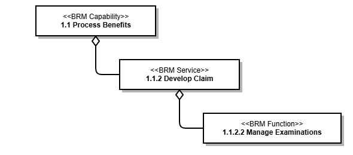

**Diagram Text Content (OCR extracted for Copilot):**

```
<<BRM Capabilty>>
4.4 Process Benefits
<<BRM Service>>
1.4.2 Develop Claim
<<BRM Function>>
1.1.2.2 Manage Examinations
```

### Content

Use Cases
The Use Case View describes the primary functions Exam Management e xtends to its users.
Main Actors
Name Description
VBMS User Veteran Service Representative  (VSR) or other user who processes claims.  
DAS System Actor DAS System calls are exchanged with Exam Vendors (VHA or VBA contractors).
System/Tenant/Application Description

## Page 4

The following table describes each system/tenant/application (rectangles) listed in the diagram above. 
System Name Description
VBMS : Exam Management UI Veteran Benefits Management System.
bip-message-workflow and related microservices Message workflow and related microservices that carry out the various functions
Main User Functions (Use Cases)
The following table describes each of the use cases (ovals) in the diagram above.
Actor(s) System Ability Details
VBMS User VBMS : Exam Management UI Create, delete, save and 
submit ESRAs a VBMS User I need the ability to create, delete, save and submit Exam Schedule 
Requests in VBMS : Exam Management UI.
VBMS User VBMS : Exam Management UI Cancel Contentions As a VBMS User I need the ability to cancel Contentions in VBMS : Exam 
Management UI.
VBMS User VBMS : Exam Management UI Modify claim information As a VBMS User I need the ability to modify claim information in VBMS : Exam 
Management UI.
VBMS User VBMS : Exam Management UI View and modify appointments As a VBMS User I need the ability to view and modify appointments in VBMS : Exam 
Management UI.
VBMS User VBMS : Exam Management UI Request appointment 
cancellationAs a VBMS User I need the ability to request that an appointment be canceled in 
VBMS : Exam Management UI.
VBMS User VBMS : Exam Management UI Create appointment 
rescheduling requestAs a VBMS User I need the ability to request that an appointment be rescheduled in 
VBMS : Exam Management UI.
VBMS User VBMS : Exam Management UI Submit a response to a 
request for clarificationAs a VBMS User I need the ability to respond to a request for clarification in VBMS : 
Exam Management UI.
VBMS User VBMS : Exam Management UI Modify data pertaining to 
contentionsAs a VBMS User I need the ability to modify data as it pertains to contentions in VBMS 
: Exam Management UI.
VBMS User VBMS : Exam Management UI View Exam Transaction 
DetailsAs a VBMS User I need the ability to View Exam Transaction Details in VBMS : Exam 
Management UI via the Enhanced History.
DAS 
System 
Actorbip-message-workflow and 
related microservicesRequest Contention 
cancellationThe EMS needs the ability to request that a Contention be canceled.
DAS 
System 
Actorbip-message-workflow and 
related microservicesComplete appointment The EMS needs the ability to complete an appointment.
DAS 
System 
ActorExam Management System Cancel appointment The EMS needs the ability to cancel an appointment.
DAS 
System 
Actorbip-message-workflow and 
related microservicesSchedule or Reschedule an 
appointmentThe EMS needs the ability to schedule or reschedule an appointment.
DAS 
System 
Actorbip-message-workflow and 
related microservicesCreate a request for 
clarification for an ESRThe EMS needs the ability to create a request for clarification to be sent to VBMS for 
an Exam Schedule Request.
DAS 
System 
Actorbip-message-workflow and 
related microservicesNotify of Complete Result 
PackageThe EMS needs the ability to send a notification of Complete Result Package.
Primary Systems High Level Operational Viewpoint ( OV-1)
The OV-1 Primary Systems High Level Operational Viewpoint describes the operational flow between the primary systems involved with fulfilling the 
functionalities of Exam Management.

## Page 5

### Diagrams/Images


**Diagram Text Content (OCR extracted for Copilot):**

```
\Exam Destination}
\VBMS Ratings
Import DBQ
‘Suggested vendor / DBQ XML
destination P| VBMS Core Claim Evidence ¢— PEC XML»! vaseo
J rake tem *
Updates
Submit ESR Document Veteran documents
Generation —
DBQ XML
Exam Management Tenant Apps Batch App
T
a Manifest’ a
ESR Event Package Veteran
documents
ESR/Contention/Appointment Results Available DBOQXML
messages Event Package
(RAP)
vy
DEQ
es Message —>| es)
A T A
Manifest
Acknowledge Veteran
ESR message documents
Results Available
ESR ESR/Contention/Appointment Event Package
Event Package messages (RAP)
v DBQ XML
Vendors
(VHA CAPRI / MDEO Contract Vendors)
```

### Content

Legend
Gray R rce to resource being documented ectangle = External resou
White Rectangle = Internal resource to resource being documented
The table below describes the lines and arrows in the diagram above: 
System A and VASI ID System B and VASI ID  Interaction Description
Exam Destination #3032 VBMS Core #3356 Suggested vendor / destination
VBMS Core #3356 Exam Management #3005 Submit ESR
Exam Management #3005 VBMS Core #3356 Document Generation -  Delegates to Core to leverage Narrative Context Wrappers and 
Correspondence.
Exam Management #3005 VBMS Core #3356 Tracked Item Updates -  Updates Claim Suspense Data based on Tracked Item
Exam Management #3005 DAS #1979 ESR Event Package
Exam Management #3005 DAS #1979 Send and receive ESR/Contention/Appointment messages
Exam Management #3005 DAS #1979 Manifest / Veteran documents
DAS #1979 EMS ESR Event Package
DAS #1979 EMS Manifest / Veteran Documents
DAS #1979 HAIMS DBQ Message
DAS #1979 Claim Evidence - eFolder 
#3023DBQ XML
DAS #1979 Exam Management #3005 Results Available Event Package
EMS DAS #1979 Acknowledge ESR message
EMS DAS #1979 Send and receive ESR/Contention/Appointment messages
EMS DAS #1979 Results Available Event Package
EMS DAS #1979 DBQ XML
Claim Evidence - eFolder 
#3023Exam Management #3005 Veteran documents

## Page 6

### Diagrams/Images

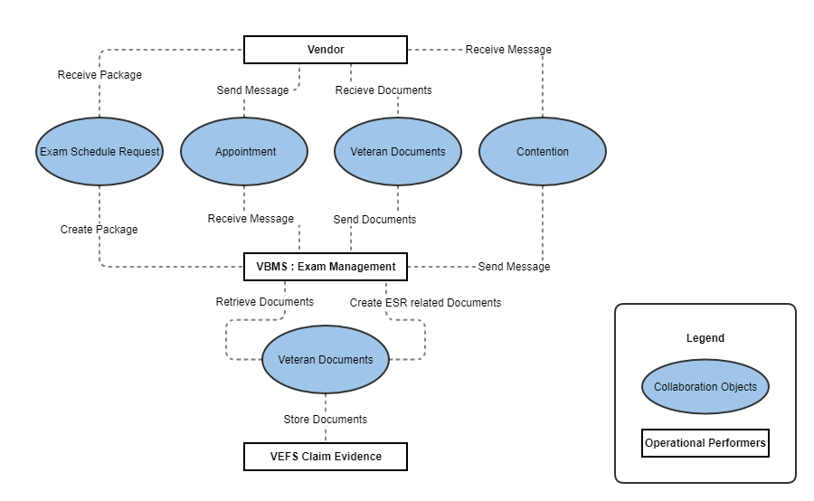

**Diagram Text Content (OCR extracted for Copilot):**

```
Vendor -
~ Receive Message
Receive Package
Send Message ~' Recieve Documents
Receive Message Send Documents
Create Package
VBMS : Exam Management
‘Send Message
Retrieve Documents Create ESR related Documents
Store Documents
Operational Performers|
VEFS Claim Evidence
```

### Content

Claim Evidence - eFolder 
#3023VASRD DBQ XML Form Data
Claim Evidence - eFolder 
#3023VBMS Ratings Import DBQ
Operational Resource Flow ( )OV-2
Logical View
Systems Interface Description ( )SV-1
The SV-1: Systems Interface Description describes the types of interfaces between the primary systems and components involved with  completing the
functions of Exam Management.

## Page 7

### Diagrams/Images

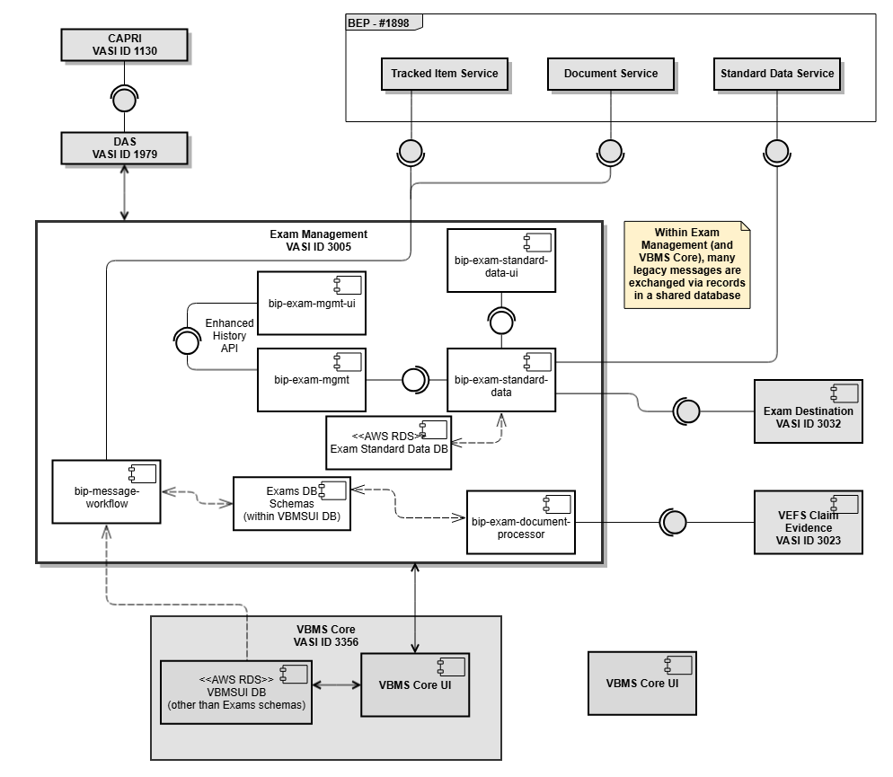

**Diagram Text Content (OCR extracted for Copilot):**

```
BEP -#1898
CAPRI
VASIID 1130
Tracked Item Service Document Service Standard Data Service
cots O ©
Exam Management Within Exam
VASI ID 3005 a ‘Management (and
bip-exam-standard- VBMS Core), many
data-ul legacy messages are
z ] exchanged via records
ina shared database
bip-exam-mgmt-ui
Enhanced
History
API
bip-exam-mgmt bip-exam-standard-
data £4
Exam Destination
VASIID 3032
bip-message- Exams DBE
Schemas ¢
(within VBMSUI DB) bip-exam-documere Vers cial
Processor VASIID 3023
\VBMS Core
VASI ID 3356
<aws ros-> &_] i] vans cour |
<AWS RDS> BMS Core UI
(other than Exams schemas)
```

### Content

Legend
Gray Rectangle = External resource to resource being documented
White Rectangle = Internal resource to resource being documented
Component References Table
Name Description
bip-
exam-
mgmtIs an API service to provide data to the bip-exam-mgmt-ui. 
bip-
exam-
mgmt-uiAn additional UI to display exams related to a claim with detailed transactional details. This provides a much finer level of detail related to 
exam management messages, how they are process, system level changes related to them. This is used by advanced or admin users to 
triage issues related to messages. 
bip-
exam-
standar
d-dataThis is an API used to provide data to the bip-exam-standard-data-ui. This is responsible for processing data transactions related to standard 
language management. 
bip-
exam-
standar
d-data-
uiThis is the UI tenant related to standard language admin tool. This UI displays editable standard language sets that are managed by MDEO 
Admin users. Standard language are instructions to medical examiners about an exam request and what information needs to be returned in 
DBQs. 
bip-
messag
e-
workflowThis service is responsible for ordering, evaluating, and processing all outbound (VBMS to vendor) and inbound (vendor to VBMS) message. 
This service performs the functions of:
Ordering inbound messages
Determining the eligibility
Updating state within the ESR
Orchestrating any workflow steps
Workflow steps may include generating documents to be added to the Veteran eFolder, managing tracked Items, or generating response 
messages as needed. 

## Page 8

bip-
exam-
docume
nt-
process
orThe exam document processor is responsible for sending all eFolder documents related to a Veteran when new exam requests are sent to 
vendors The exam document processor integrates with the Claim Evidence API services to build a manifest of documents, transfer the 
manifest, and also send all Veteran related documents to the MDE vendors. 
VEFS 
Claim 
Evidenc
e - 
eFolderClaim Evidence is a file service for handling the storage and management of files supporting VA benefit claims.
Exam 
Destinat
ionExam Destination (ED) is a VBMS service that Exam Management utilizes when scheduling veteran exams. Exam Destination recommends 
the optimal Vendor to perform the exam based on current capacity and rules. In fact, the term Destination is really synonymous with Vendor. 
The major functional areas of Exam Destination include:
Allow users to create and modify Rules through a simplified user interface.
Manage approval and activation of Rules.
View the Net Adjusted Allocation Count (NAAC) data.
Obtain optimal Vendor suggestions derived from NAAC data and the currently active Rule.
Exam Management is the only consumer of ED’s published application programming interface (API) endpoints at this time. These endpoints 
are secured via a Java Web Token (JWT) Service account, which is established between Exam Management and the Exam Destination 
microservice.
VBMS 
RatingsVBMS-R allows rating specialists to rate a case, determining the extent of disability and recommending a disability benefit.
VBMS 
CoreVBMS Core is a component of VBMS used to create and develop a Veteran's claim. It is the primary maintenance center for Veteran Service 
Representatives (VSRs). Core also includes the National Work Queue (NWQ) application.
BEP 
ServicesBenefits Enterprise Platform (BEP) Services, formerly known Benefits Gateway Services (BGS) or Benefits Integration Services (BIS), 
provides secure integration web services to VBA Corporate Database providing access to Veteran, Claims, Ratings, and Awards data. BEP 
Services acts as an advisor during conceptual design of new projects and enhancements to the existing systems. BEP Services ensures 
maximum reuse of services and components among and between new development initiatives and current systems in operations
/sustainment.   
DAS DAS, formerly Virtual Lifetime Electronic Record (VLER), is an integrated system that acts as a proxy between consumers and producers of 
data, aggregating data from multiple data producers to respond to consumer-initiated data transactions.
CAPRI The Compensation and Pension Record Interchange (CAPRI) project is an information technology initiative to improve service to disabled 
veterans by promoting efficient communication between the Veterans Health Administration (VHA) and Veterans Benefits Administration 
(VBA). CAPRI provides VBA employees with a standardized, user-friendly method to rapidly access veterans' electronic medical records 
throughout the Department of Veterans Affairs (VA). CAPRI is an alternative user interface for the Veterans Health Information Systems and 
Technology Architecture (VistA) systems, which are terminal, text-based systems.
HAIMS When VBMS users need access to the Veteran Service Treatment Record (STR) documents, it is used to determine if a disability is service 
connected. STRs are available to DAS electronically from the DoD HAIMS system. VBMS automatically subscribes to DAS for an STR when 
a claim is established. When the DoD has assembled the proper documentation for the STR, DAS obtains the documents and notifies VBMS 
to retrieve them.
Vendor Connected parties outside the VA that will integrate with this architecture to schedule exam appointments and manage the request lifecycle .
Services Context (  (VASI APIs)SvcV-1)
The SvcV-1 describes the connections and dependencies between Exam Management services and connections between Exam Management services 
and services outside of Exam Management.

## Page 9

### Diagrams/Images

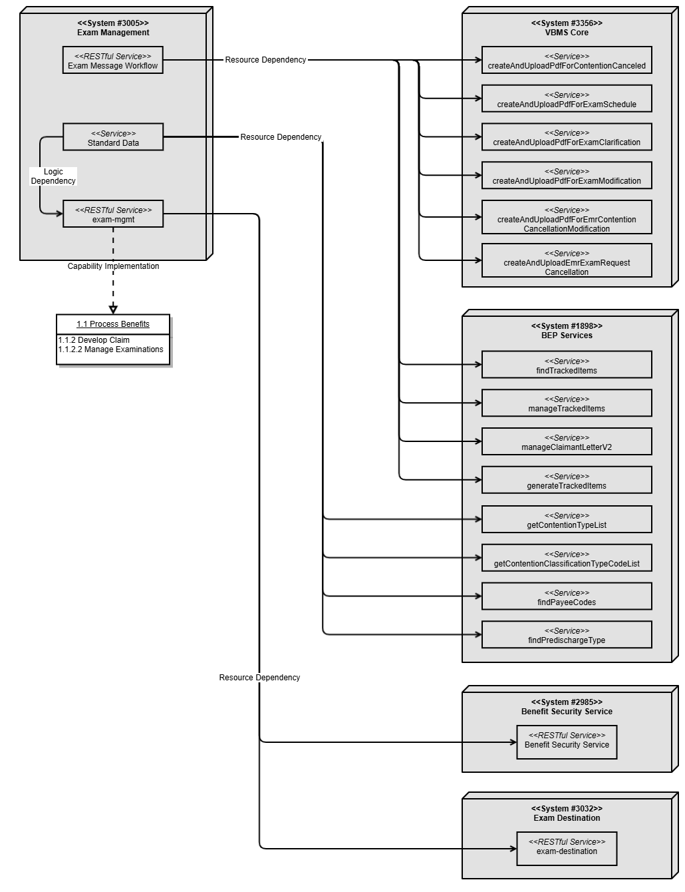

**Diagram Text Content (OCR extracted for Copilot):**

```
<<System #3005>>
Exam Management
=<RESTIul Service>>
Exam Message Workflow
Resource Dependency
Resource Dependency
<<Service>>
( Standard Data
Logic
Dependency
<<RESTIul Service>>
exam-mgmt
Capabilty Implementation
1.1 Process Benefits
F.2 Develop Claim
1.1.2.2 Manage Examinations
Resource Dependency
>| createAndUploadPdfF orContentionCanceled
<<System #3356>>
VEMS Core
=<Senvice>>
=<Senvice>>
createAndUploadPdfF or xamSchedule
=<Senvice=>
createAndUploadPdfF orExamCiarification
=<Senvice>>
createAndUploadPdfF or xamModification
<<Senvice=>
createAndUploadPdfF orEmrContention
CancellationModification
<<Service>>
createAndUploadEmrExamRequest
Cancellation
<<System #1898>>
BEP Services
<<Service>>
findTrackedltems
<<Senvice>>
manageTrackeditems
=<Semvice>>
manageClaimantletterV2
=<Semvice>>
generateTrackeditems
=<Senvice>>
getContentionTypeList
=<Senvice>>
getContentionCiassificationTypeCodelist
=<Senvice>>
findPayeeCodes
=<Semvice>>
findPredischargeType
<<System #2085>>
Benefit Security Service
=<RESTIul Service>>
Benefit Security Service
<<System #3032>>
Exam Destination
<<RESTIul Service>>
‘exam-destination
```

### Content

Service/API Operation ID Description
Exam Management (3005) /api/v1/exammgmt/exam-message
/ContentionSpecialInstructionsRequestMessage/{eventUuid}Retrieves Contention Special Issue Instruction 
Request Messages
Exam Management (3005) /api/v1/exammgmt/exam-message
/ExamClarificationResponseRequestMessage/{eventUuid}Retrieves ESR Clarification Response Request 
Messages
Exam Management (3005) /api/v1/exammgmt/exam-message
/ExamClarificationRequestMessage/{eventUuid}Retrieves ESR Clarification Request Messages
Exam Management (3005) /api/v1/exammgmt/exam-message
/ExamScheduleRequestMessageRetrieves ESR Messages
Exam Management (3005) /api/v1/exammgmt/exam-message/examRequestsByUuid Retrieves ESRs
Exam Management (3005) /api/v1/exammgmt/exam_request_contentions/{esrUuid} Retrieves Contentions for an ESR
Exam Management (3005) /api/v1/exammgmt/exam-message
/AppointmentCanceledRequestMessage/{eventUuid}Retrieves Appointment Canceled Request 
Messages

## Page 10

Exam Management (3005) /api/v1/exammgmt/exam-message
/AppointmentCompletedRequestMessage/{eventUuid}Retrieves Appointment Completed Request 
Messages
Exam Management (3005) /api/v1/exammgmt/exam-message
/AppointmentScheduledRequestMessage/{eventUuid}Retrieves Appointment Scheduled Request 
Messages
Exam Management (3005) /api/v1/exammgmt/exam-message
/AppointmentUpdatedRequestMessage/{eventUuid}Retrieves Appointment Updated Request 
Messages
Exam Management (3005) /api/v1/exammgmt/exam-message
/ExamAddressChangeRequestMessage/{eventUuid}Retrieves Exam Address Change Request 
Messages
VBMS UI Web (3356) /jwt/api/exam/v1/createAndUploadPdfForContentionCanceled Create and Upload PDF for: Contention 
Canceled
VBMS UI Web (3356) /jwt/api/exam/v1/createAndUploadPdfForExamSchedule Create and Upload PDF for: Exam Scheduled
VBMS UI Web (3356) /jwt/api/exam/v1/createAndUploadPdfForExamClarification Create and Upload PDF for: Exam Clarification
VBMS UI Web (3356) /jwt/api/exam/v1/createAndUploadPdfForExamModification Create and Upload PDF for: Exam Modification
VBMS UI Web (3356) /jwt/api/exam/v1
/createAndUploadPdfForEmrContentionCancellationModificationCreate and Upload PDF for: EMR Contention 
cancellation Modification
VBMS UI Web (3356) /jwt/api/exam/v1/createAndUploadEmrExamRequestCancellation Create and Upload PDF for: EMR Exam 
Request cancellation
BEP Services (1898) : 
TrackedItemServicefindTrackedItems Retrieves Tracked Items
BEP Services (1898) : 
TrackedItemServicemanageTrackedItems Updates Tracked Items
BEP Services (1898) : 
DocumentServicemanageClaimantLetterV2 Manages Claimant Letters
BEP Services (1898) : 
DocumentServicegenerateTrackedItems Creates Tracked Items
BEP Services (1898) : 
StandardDataServicegetContentionTypeList Retrieves Contention Types
BEP Services (1898) : 
StandardDataServicegetContentionClassificationTypeCodeList Retrieves Contention Classification Type Codes
BEP Services (1898) : 
ShareStandardDataServicefindPayeeCodes Retrieves Payee Codes
BEP Services (1898) : 
StandardDataWebServicefindPredischargeType Retrieves Predischarge Types
BSS (2985) Benefit Security Service Provides authentication and authorization
Exam Destination (3032) /api/v1/exam-destination/examRouting/requestDestination Determine suggested and possible destinations 
(vendors) for an exam
Services Resource Flow ( )SvcV-2
The SvcV-2: Resource Flow of Primary Services describes the resource flow between Exam Management services and services outside of Exam 
Management.
Source 
SystemSource Service Source 
OperationTarget System Target Service Target 
Operation
VBMS UI Web - - Exam Management /api/v1/exammgmt/exam-message
/ContentionSpecialInstructionsRequestMessage/{eventUuid}GET
VBMS UI Web - - Exam Management /api/v1/exammgmt/exam-message
/ExamClarificationResponseRequestMessage/{eventUuid}GET
VBMS UI Web - - Exam Management /api/v1/exammgmt/exam-message
/ExamClarificationRequestMessage/{eventUuid}GET
VBMS UI Web - - Exam Management /api/v1/exammgmt/exam-message
/ExamScheduleRequestMessageGET
VBMS UI Web - - Exam Management /api/v1/exammgmt/exam-message/examRequestsByUuid GET
VBMS UI Web - - Exam Management /api/v1/exammgmt/exam_request_contentions/{esrUuid} GET

## Page 11

VBMS UI Web - - Exam Management /api/v1/exammgmt/exam-message
/AppointmentCanceledRequestMessage/{eventUuid}GET
VBMS UI Web - - Exam Management /api/v1/exammgmt/exam-message
/AppointmentCompletedRequestMessage/{eventUuid}GET
VBMS UI Web - - Exam Management /api/v1/exammgmt/exam-message
/AppointmentScheduledRequestMessage/{eventUuid}GET
VBMS UI Web - - Exam Management /api/v1/exammgmt/exam-message
/AppointmentUpdatedRequestMessage/{eventUuid}GET
VBMS UI Web - - Exam Management /api/v1/exammgmt/exam-message
/ExamAddressChangeRequestMessage/{eventUuid}GET
Exam 
Message 
Workflow/bip-message-workflow
/api/v1/messagePOST VBMS UI Web /jwt/api/exam/v1/createAndUploadPdfForContentionCanceled POST
Exam 
Message 
Workflow/bip-message-workflow
/api/v1/messagePOST VBMS UI Web /jwt/api/exam/v1/createAndUploadPdfForExamSchedule POST
Exam 
Message 
Workflow/bip-message-workflow
/api/v1/messagePOST VBMS UI Web /jwt/api/exam/v1/createAndUploadPdfForExamClarification POST
Exam 
Message 
Workflow/bip-message-workflow
/api/v1/messagePOST VBMS UI Web /jwt/api/exam/v1/createAndUploadPdfForExamModification POST
Exam 
Message 
Workflow/bip-message-workflow
/api/v1/messagePOST VBMS UI Web /jwt/api/exam/v1
/createAndUploadPdfForEmrContentionCancellationModificat
ionPOST
Exam 
Message 
Workflow/bip-message-workflow
/api/v1/messagePOST VBMS UI Web /jwt/api/exam/v1
/createAndUploadEmrExamRequestCancellationPOST
Exam 
Message 
Workflow/bip-message-workflow
/api/v1/messagePOST BEP Services : 
TrackedItemServicefindTrackedItems GET
Exam 
Message 
Workflow/bip-message-workflow
/api/v1/messagePOST BEP Services : 
TrackedItemServicemanageTrackedItems POST
Exam 
Message 
Workflow/bip-message-workflow
/api/v1/messagePOST BEP Services : 
DocumentServicemanageClaimantLetterV2 POST
Exam 
Message 
Workflow/bip-message-workflow
/api/v1/messagePOST BEP Services : 
DocumentServicegenerateTrackedItems POST
Exam 
Standard Data- - BEP Services : 
StandardDataServicegetContentionTypeList GET
Exam 
Standard Data- - BEP Services : 
StandardDataServicegetContentionClassificationTypeCodeList GET
Exam 
Standard Data- - BEP Services : 
ShareStandardDataServicefindPayeeCodes GET
Exam 
Standard Data- - BEP Services : 
StandardDataWebServicefindPredischargeType GET
Exam 
Managementexam-mgmt - BSS Benefit Security Service -
Exam 
Managementexam-mgmt - Exam Destination /api/v1/exammgmt/exam-destination/history/{esrUuid} GET
Exam 
Managementexam-mgmt - Exam Destination /api/v1/exam-destination/examRouting/requestDestination POST
Internal and External Systems-Systems Matrix ( ) (VASI Interfaces)3 SV-3/SvcV-
System or Service A System or Service B Internal 
or 
ExternalConsumer or Dependency
(in relation to System A)
VBMS Core : VBMS UI Web (3356) Exam Management (3005) Internal to 
VBMSVBMS UI Web is a consumer of Exam Management
Exam Management : Exam Message Workflow 
(3005)VBMS Core (3356) Internal to 
VBMSExam Message Workflow is a consumer of VBMS Core

## Page 12

### Diagrams/Images

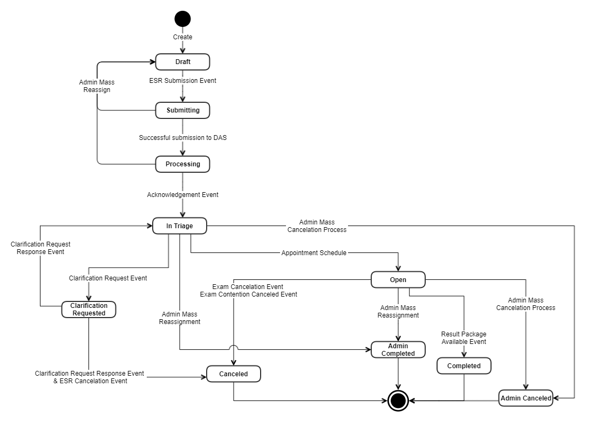

**Diagram Text Content (OCR extracted for Copilot):**

```
e
Create
‘Admin Mass ESR Submission Event
Reassign
‘Successful submission to DAS:
Acknowledgement Event
‘Admin Mass
In Triage ‘Cancelation Process:
Clarification Request
Response Event Appointment Schedule:
Clarification Request Event
Reassignment
Exam Cancelation Event
Exam Contention Canceled Event
Clarification Request Response Event
& ESR Cancelation Event
Canceled
Open
Admin Mass
Reassignment
‘amin
Completed
Result Package
Available Event
Completed
‘Admin Mass
Cancelation Process
[Admin Canceled)
```

### Content

Exam Management : exam-mgmt (3005) Exam Destination (3032) Internal to 
VBMSEM depends on Exam Destination
Exam Management : exam-mgmt (3005) BSS (2985) Internal to 
VBMSEM depends on BSS
Exam Management (3005) DAS (1979) External to 
VBMSEM depends on DAS a gateway system to transmit messages 
from VBMS to MDEO Vendor systems. 
Exam Management : Standard Data (3005) BEP Services (1898) : 
TrackedItemServiceExternal to 
VBMSEM Standard Data consumes BEP Services
Exam Management : Standard Data (3005) BEP Services (1898) : 
DocumentServiceExternal to 
VBMSEM Standard Data consumes BEP Services
Exam Management : Standard Data (3005) BEP Services (1898) : 
StandardDataServiceExternal to 
VBMSEM Standard Data consumes BEP Services
Exam Management : Standard Data (3005) BEP Services (1898) : 
ShareStandardDataServiceExternal to 
VBMSEM Standard Data consumes BEP Services
Exam Management : Standard Data (3005) BEP Services (1898) : 
StandardDataWebServiceExternal to 
VBMSEM Standard Data consumes BEP Services
HAIMS Exam Management (3005) External to 
VBMSNeither. HAIMS provides service treatment documents (STRs) 
and they passively receive DBQs from DAS. 
Exam Management (3005) CAPRI (1130) External to 
VBMSVBMS consumes DBQs from CAPRI
VBA Exam Vendor: Loyal Source Government 
Services (LSGS)Exam Management (3005) External to 
VAEM depends on vendors to exchange exam requests, provide 
status updates, and provide DBQ responses. 
VBA Exam Vendor: Quality, Timeliness, Customer 
Service Management, Inc. (QTC)Exam Management (3005) External to 
VAEM depends on vendors to exchange exam requests, provide 
status updates, and provide DBQ responses. 
VBA Exam Vendor: Optum Serve Health Svc 
(OSHS)Exam Management (3005) External to 
VAEM depends on vendors to exchange exam requests, provide 
status updates, and provide DBQ responses. 
VBA Exam Vendor: Veterans Evaluation Service 
(VES)Exam Management (3005) External to 
VAEM depends on vendors to exchange exam requests, provide 
status updates, and provide DBQ responses. 
VHA EMS (Cerner) Exam Management (3005) External to 
VBMSNote: CERNER is not currently active in EM integrations.
EM depends on vendors to exchange exam requests, provide 
status updates, and provide DBQ responses. 
State Transitions ( )OV-6b
Exam Management State Transitions for ESR, Contention, and Appointments as EM messages are processed.
Exam Schedule Request State Transitions


## Page 13

State Description
Draft VSR has created a new request that has yet to be sent to EMS. Request can be changed here without restriction.
Submitting VSR submits the request, creating a Tracked Item and PDF document
Submitting A request is set to be submitted to DAS. At this point the request is considered submitted
Processing ESR will move to this state once it has been submitted by the VSR
Draft Changes need to be made to the ESR
Processing The request has been successfully submitted to DAS, but has not been acknowledged
In Triage Request has been acknowledged by the EMS
Draft Changes need to be made to the ESR
In Triage The EMS has acknowledged receival of request and is beginning triage process
Clarification Requested A gap has been found and/or alteration to request is needed before scheduling appointments
Open No current action is needed but ESR is not complete
Admin Canceled ESR will move to this state when mass canceled by admin
Admin Complete An Admin mass reassignment has occurred
Clarification Requested VSR needs to alter request to fill any gaps, but once an appointment has been scheduled this will no longer be available
In Triage ESR will move to this state when the request for clarification is fulfilled and the ESR is properly updated
Canceled ESR will move to this state when canceled
Open No current action is needed but ESR is not complete
Canceled ESR will move to this state when canceled
Completed Appointment has been made and a results package is now available
Admin Canceled ESR will move to this state when mass canceled by admin
Admin Complete An Admin mass reassignment has occurred
Canceled Request has been canceled for any number of reasons, such as Veteran death.
FinalCanceled is a final state
Admin Completed Admin mass reassignment process has occurred
FinalAdmin Completed is a final state
Completed Results Package has become available
FinalCompleted is a final state
Admin Canceled Admin mass cancellation process has occurred
FinalAdmin Canceled is a final state
Contention State Transitions

## Page 14

### Diagrams/Images


**Diagram Text Content (OCR extracted for Copilot):**

```
raft Exam Submission Event: Processing
Contention Removed
before Exam Submission Event
Rem
Clarification Request
Response (Contention Removed)
joved
Exam Mass
‘Admin Cancel
Exam Acknowledgement Event
4 Exam Mass
__ in triage ‘Admin Cancel
Contention
\ cancelation
Event
Result Package
Available Event
lL ‘Appointment Creation
Available Event
Canceled
Exam Mass
Event
>( scheduled
‘Admin Cancel
Appointment Canceled Event
(All appointments canceled)
conten -——¥
Appointment Creation
Event
Appointment Completed Event
(All appointments terminal)
Pending
Documents
‘Admin_Canceled : Exam Mass
Cancelation pen
event = \____J
Result Package
Available Event
Result Package
‘Admin Cancel
‘Admin_Canceled : Exam Mass
‘Admin Cancel
Exam Mass
‘Admin Cancel,
‘Ramin
Completed
‘Rami
Canceled
```

### Content

State Description
Draft Exam has been scheduled linked to contention
Processing An exam linked with a contention has been successfully submitted, but not yet acknowledged
Removed Contention was removed before an examination occurred
Processing Exam with linked contention is awaiting acknowledgment
Admin Canceled Exam mass admin cancel has occurred
In Triage Exam has been acknowledged
Removed Contention was removed from exam before submission
FinalRemoved is a final state
In Triage Exam submission has been acknowledged and is beginning triage process
Removed The contention has been removed following a clarification request
Canceled The contention has been canceled
Completed Results package has become available
Scheduled An appointment has been created to carry out exam
Admin Canceled An exam mass admin cancel has occurred
Scheduled Appointment is scheduled and awaiting appointment date
Open An appointment canceled event has occurred for all appointments
Pending Documents An appointment completed event has occurred.
Admin Completed An exam mass admin cancel has occurred
Admin Canceled An exam mass admin cancel has occurred
Pending Documents Appointment has been completed and documents are being processed
Scheduled More appointments are needed
Completed The results package has become available
Admin Completed An exam mass admin cancel has occurred

## Page 15

### Diagrams/Images

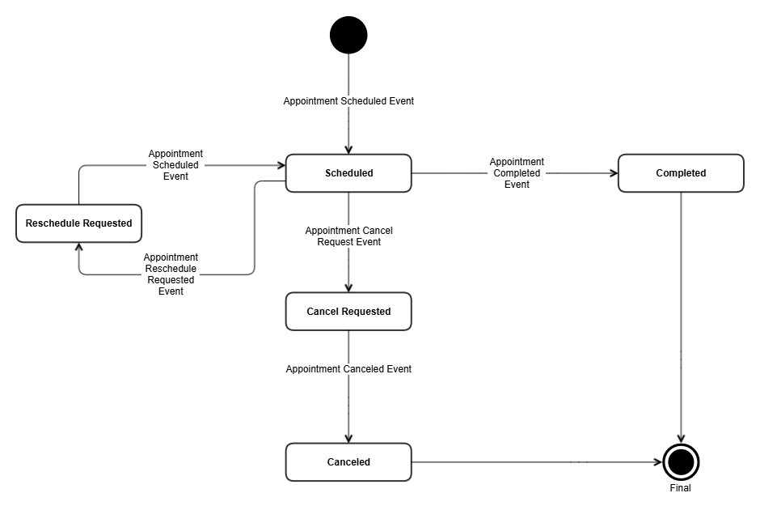

**Diagram Text Content (OCR extracted for Copilot):**

```
Appointment
‘Scheduled
Event
Reschedule Requested
Appointment
Reschedule
Requested
Event
Appointment Scheduled Event
gy
Scheduled
—4
Appointment Cancel
Request Event
ot
Cancel Requested
Appointment Canceled Event
———_Ja—___,
Canceled
Appointment
Completed
Event
Completed
Final
```

### Content

Open No appointments are currently scheduled but the Contention still has not closed
Canceled The contention has been canceled
Completed The results package has become available
Admin Canceled An exam mass admin cancel has occurred
Canceled The contention was canceled
FinalCanceled is a final state
Admin Canceled An exam admin mass cancel has occurred
FinalAdmin Canceled is a final state
Completed The results package linked to contention has been made available
FinalCompleted is a final state
Admin Completed An exam mass admin cancel has occurred
FinalAdmin Completed is a final state
Appointment State Transitions
State Description
Scheduled Appointment has been scheduled or rescheduled (either as the same appointment or under a new UUID). This exists for both ACE 
and normal appointments
Reschedule 
RequestedAppointmentRescheduleRequestedEvent is triggered, regardless of where the trigger takes place.
Cancel Requested AppointmentCancelRequestEvent is triggered, the appointment is not yet canceled only requested to be 
canceled
Completed AppointmentCompleteEvent is triggered, and appointment has taken place
Reschedule 
RequestedA request to reschedule has been made that needs to be fulfilled by the EMS
Scheduled AppointmentScheduledEvent has triggered and the appointment has been rescheduled by the EMS

## Page 16

### Diagrams/Images

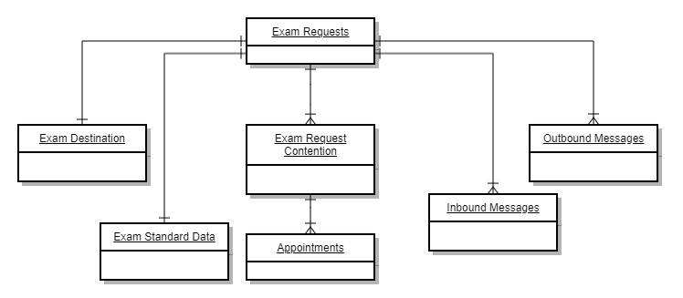

**Diagram Text Content (OCR extracted for Copilot):**

```
Exam Requests
Exam Standard Data
Inbound Messages
Appointments
```

### Content

Cancel Requested A request to cancel has been submitted and is awaiting cancellation by the EMS
Canceled AppointmentCanceledEvent has triggered
Canceled EMS has formally canceled the appointment
FinalCanceled is a final state
Completed The appointment took place and is completed
FinalCompleted is a final state
Data Models
Conceptual Data Viewpoint Model ( )DIV-1
The Conceptual Data Viewpoint Model provides a high-level overview of the main Exam Management data concepts and their relationships to each other. 
Attribute 
NameData 
TypeMultiplicity Constraints Description
Exam Request Object Root Object none The Exam Request is the fundamental object for examination requests. 
Exam Destination Object 1..* none The Exam Destination record is includes the input parameters used to request a destination, the 
suggestion options, and the user selection. 
Exam Standard 
DataObject 1..1 none The Exam Standard Data is a representation of the instructions to clinicians on the information 
needed to be provided in a DBQ response. 
Exam Request 
ContentionObject 1..* none The Exam Request Contention is a collection of Contentions from a Claim that are associated with the 
specific exam request.
Appointments Object 1..* none An Appointment represents a scheduled appointment for contention(s). The appointment includes 
details as to specific clinician, location, date, and time.  
Outbound 
MessagesObject 1..* none This represents the messages originating from VBMS sent to the MDE vendors. 
Inbound 
MessagesObject 1..* none This represents the messages originating from MDE vendors sent to VBMS. 
Logical Data Viewpoint Model ( ) DIV-2

## Page 17

### Diagrams/Images

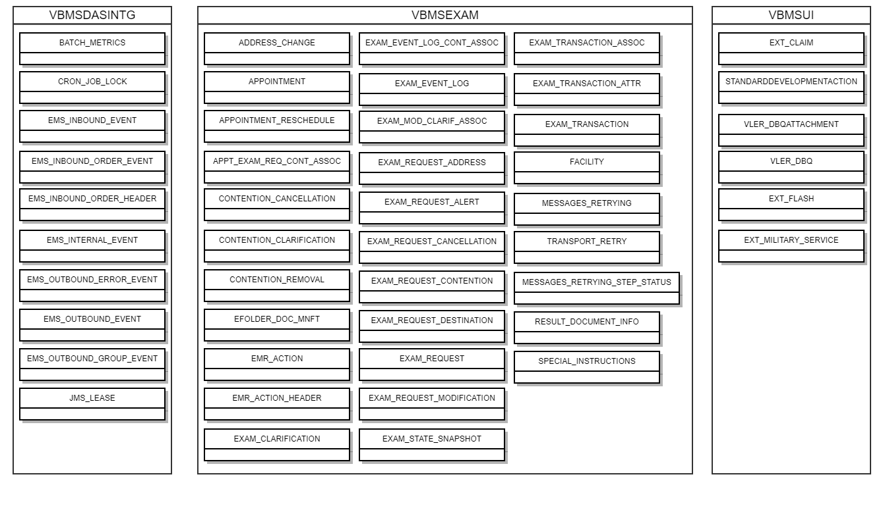

**Diagram Text Content (OCR extracted for Copilot):**

```
VBMSDASINTG
VBMSEXAM
VBMSUI
BATCH_METRICS.
ADDRESS_CHANGE
EXAM_EVENT_LOG_CONT_ASSOC
EXAM_TRANSACTION_ASSOC.
EXT_CLAIM
CRON_JOB_LOCK
APPOINTMENT
EXAM_EVENT_LOG
EXAM_TRANSACTION_ATTR
‘STANDARDDEVELOPMENTACTION
EMs_INBOUND_EVENT
APPOINTMENT_RESCHEDULE
EXAM_MOD_CLARIF_ASSOC
EXAM_TRANSACTION
VLER_DBQATTACHMENT
EMS_INBOUND_ORDER_EVENT
APPT_EXAM_REQ_CONT_ASSOC
EXAM_REQUEST_ADDRESS
FACILITY
VLER_DBQ
EMS_INBOUND_ORDER_HEADER
CONTENTION_CANCELLATION
EXAM_REQUEST_ALERT
MESSAGES_RETRYING
EXT_FLASH
EMs_INTERNAL_EVENT
CONTENTION_CLARIFICATION
EXAM_REQUEST_CANCELLATION
TRANSPORT_RETRY
EXT_MILITARY_SERVICE
EMS_OUTBOUND_ERROR_EVENT
CONTENTION_REMOVAL
EXAM_REQUEST_CONTENTION
MESSAGES_RETRYING_STEP_STATUS
EMS_OUTBOUND_EVENT
EFOLDER_DOC_MNFT
EXAM_REQUEST_DESTINATION,
RESULT_DOCUMENT_INFO
EMS_OUTBOUND_GROUP_EVENT
EMR_ACTION
EXAM_REQUEST
‘SPECIAL_INSTRUCTIONS
JMS_LEASE
EMR_ACTION_HEADER.
EXAM_REQUEST_MODIFICATION
EXAM_CLARIFICATION
EXAM_STATE_SNAPSHOT
```

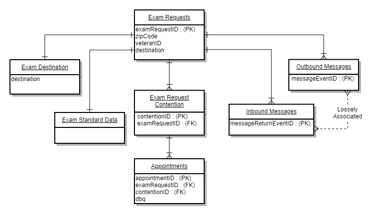

**Diagram Text Content (OCR extracted for Copilot):**

```
Exam Requests
fexamRequestIO - (PK)
[eipCode
JveteraniD
destination
Gestination
Exam Standard Data
|
Exam Request
Contention
‘contentionlD - (PK)
examRequestiD : (Fk)
A
ointments
fappointmentiD - (PK)
JexamRequestiD - (FK)
IcontentioniD : (Fk)
Jabg
Outbound Messag
TmessageeventiD (PK)
Loosely
Associated
Inbound Messages
fmessageRetumeventiD - (PK)
```

### Content

Physical Data Viewpoint Model ( )DIV-3
Process View (Business Process Model)
Main Business Process Model (OV-6d)
ESR and Appointment Process Model

## Page 18

### Diagrams/Images

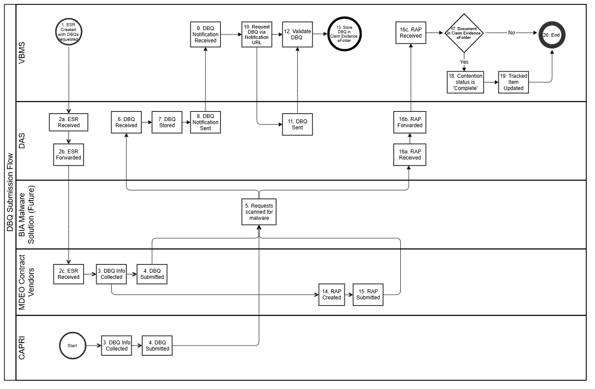

**Diagram Text Content (OCR extracted for Copilot):**

```
DBQ Submission Flow
BIA Malware
Solution (Future)
MDEO Contract
Vendors
CAPRI
y
2a. ESR
Received
J
9.DBQ
Notification
Received
10. Request
DBO via |_,/12. Validate]
Notification DEQ
URL
6. DBQ
Received
3060
7,080 | sl wcinaton
St
11. DBQ
Sent
12.St0re
46c. RAP
Received
a ©)
18. Contention]
status is
‘Complete!
19. Tracked|
>| Item
Updated
416. RAP
Forwarded
t
16a. RAP
Received
5. Requests
‘scanned for
malware
ry
v
2c. ESR 3. DBQ Info|_,} 4. DBa
Received [>| Collected |~>| Submitted
14. RAP
Collected
3. pea info} | 4.080
‘Submitted
Created
18. RAP.
‘Submitted
```

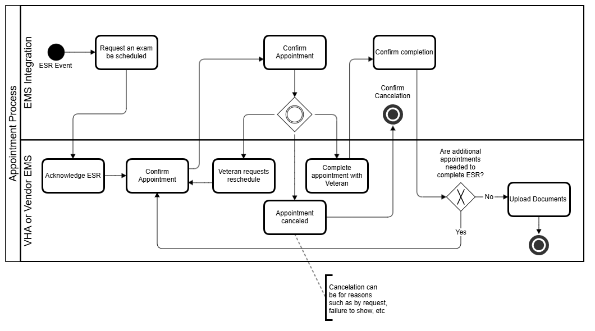

**Diagram Text Content (OCR extracted for Copilot):**

```
Request an exam Confirm
be scheduled Appointment Confirm completion|
ESR Event
EMS Integration
2 Conti
8 cancelation
8
s
a
=
5
i=
= Ave ational
fo appointments
2 Complete needed to
ZY it | acknowedge esr Confirm Veteran requests appointment with complete ESR?
Appointment reschedule Veteran
Appointment
canceled
VHA or Vendor EMS
[Upload Documents
Cancelation can
be for reasons
such as by request,
failure to show, ete
```

### Content

Exam and DBQ Process Model
DBQ Submission Flow Details
Step System Description
DBQ Process
1 ESR 
Create
d with 
DBQs 
request
edVBMS An Exam Scheduling Request (ESR) is generated that specifies one to many Disability Benefit Questionnaires (DBQ) be 
completed by the DBQ Producers (CAPRI and MDEO Contract Vendors).
2a. 
ESR 
Receiv
edDAS DAS received the ESR.

## Page 19

2b. 
ESR 
Forwar
dedDAS DAS forwards the ESR based on routing details in the <Destination> message element.
2c. 
ESR 
Receiv
edMDEO 
Contract 
VendorVendor receives the ESR.
3. 
DBQ 
Info 
Collect
edMDEO 
Contract 
Vendor,
CAPRIThe DBQ form information is collected via appointment(s) with the Veteran.
4. 
DBQ 
Submit
tedMDEO 
Contract 
Vendor,
CAPRIThe DBQ form information is formatted to be included in the DBQ IEPD. Currently there are different IEDP versions for CAPRI 
and the MDEO Contract Vendors. They are roughly equivalent, but they have different version numbers and are managed 
separately. The DBQ Document includes: 1) the XML wrapper (Vendor, Veteran, Claim, and ESR metadata); 2) the DBQ form 
medical data; 3) no more than 1 document attachment in Base64 encoded format. Note that the document attachments include a 
provided Document Id that is also used in step 14.
5. 
Reque
sts 
scanne
d for 
MALW
ARENOC Requests are scanned by the Network Operations Center (NOC). DAS does not perform any additional MALWARE checks for 
documents or other information uploaded.
6. 
DBQ 
Receiv
edDAS DAS receives the DBQ document (see step 4)
7. 
DBQ 
StoredDAS DAS stores the DBQ document (see step 4)
8. 
DBQ 
Notifica
tion 
SentDAS DAS will create a DBQ Notification based on the DBQ Document received. The DBQ Notification includes a URL to download the 
DBQ Document from DAS.
9. 
DBQ 
Notifica
tion 
Receiv
edVBMS VBMS receives and stores the DBQ Notification.
10. 
Reque
st 
DBQ 
via 
Notifica
tion 
URLVBMS VBMS requests the DBQ Document via the URL in the DBQ Notification.
11. 
DBQ 
SentDAS DAS provides the DBQ Document back to VBMS.
12. 
Validat
e DBQVBMS VBMS will perform schema validation for the DBQ according to the version provided.
13. 
Store 
DBQ 
in 
eFolde
r.VBMS If there is a validation error (see step 12), the document is not visible in the Veteran Claim Evidence eFolder. If there are no 
validation errors (see step 12), the DBQ Document is available in the Veteran eFolder. This is the end of the DBQ Document 
process.
Results Available Package (RAP) Process

## Page 20

### Diagrams/Images

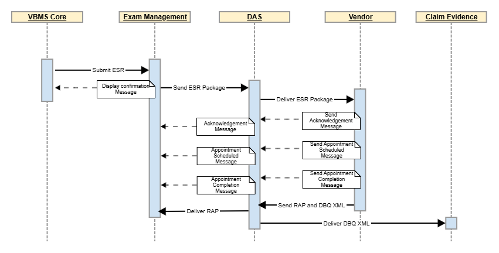

**Diagram Text Content (OCR extracted for Copilot):**

```
VEMS Core
‘Exam Management DAS
Claim Evidence
| $¢—deiver arp)
——s.oritese _—p
= = = [Biri aertmatedS L_ send sn Package:
< an ‘Send ESR Package —pp|
Deliver ESR Package >)
: aa
i —— ~~~ [ sigan)
H i - - | ae) iiss
H TS
: Tamara hy \e- - - - [Sc
H «--.{ @ae vies
i iiss
H RSI
: reamen hy |e - - - [Easier
H <«--| Sar iiespe
: iio,
H Jasons na and 080x011
Dalver 080 XML!
```

### Content

14. 
RAP 
CreatedMDEO 
Contract 
VendorMDEO Contract Vendor will generate a Results Available Package (RAP) message. The message includes an association 
between the DBQ Document Id provided by the DBQ Producer (see step 4) and the ESR Contention UUID.
15. 
RAP 
Submit
tedMDEO 
Contract 
VendorMDEO Contract Vendor sends the RAP to DAS.
16a. 
RAP 
Receiv
edDAS DAS receives the RAP message.
16b. 
RAP 
Forwar
dedDAS DAS Forwards the RAP to VBMS.
16c. 
RAP 
Receiv
edVBMS VBMS Receives the RAP. When the DBQ is received the system will attempt to confirm if the DBQ Document Id (see steps 4) 
was validated and is visible in the Claim Evidence eFolder (see steps 12 and 13).
18. 
Conten
tion 
status 
is 
'Compl
ete'VBMS If the DBQ is visible in the eFolder, the Contention status associated is set to 'COMPLETED'.
19. 
Tracke
d Item 
UpdatedVBMS If the DBQ is visible in the eFolder, the Tracked Items associated to the Contention are closed.
20. 
EndVBMS The RAP Process ends.
Process Sequence - Systems Event-Trace Description (SV- )10c
Implementation View
Primary System Technologies (SV-9) (VASI Technology Components)
For standard tools see  . VBMS SV-9 Master Table
Software Type Software Vendor Software Name Software Version TRM Link TRM ID
Currently no additional technologies.

## Page 21

Deployment View
The Deployment View provides information on Exam Management in regard to the CI/CD lifecycle. 
Environments
See VBMS Environments Info Page  for a current list of environments and descriptions. Exam Management components are deployed to all VBMS 
environments.
System Configuration
Exam Management uses the standard BIP Platform System Configuration.
System Monitoring and Metrics
A DBA process sends hourly emails about exam management performance and message throughput.
Exam Management uses the BIP Platform standard monitoring and metrics.
System Auditing
Exam Management uses the standard BIP Platform System Auditing.
System Logging
Exam Management uses the standard BIP Platform System Logging.
Security Requirements
Exam Management uses the standard BIP Platform Security Requirements.

